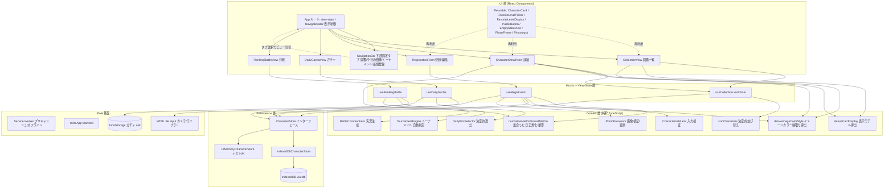
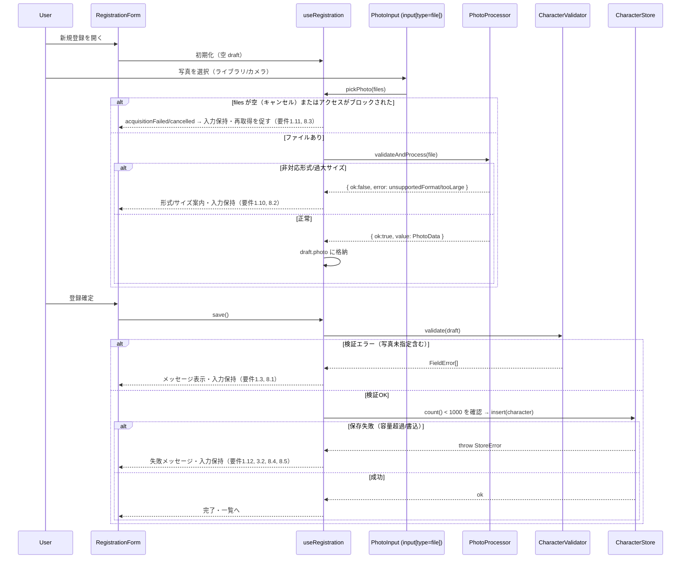
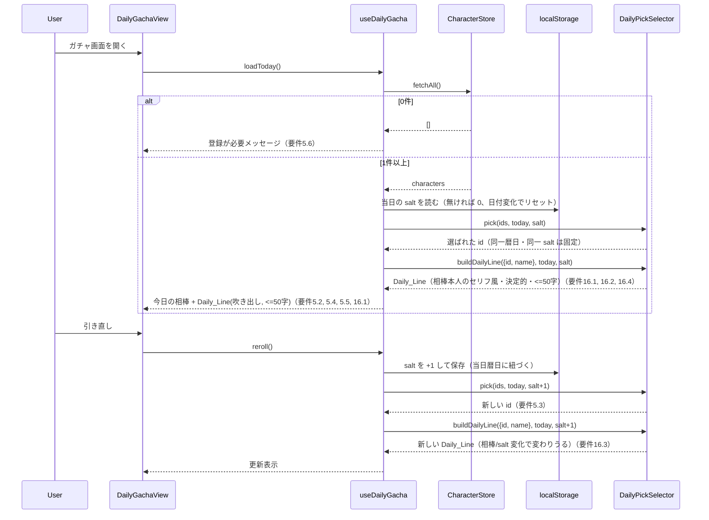
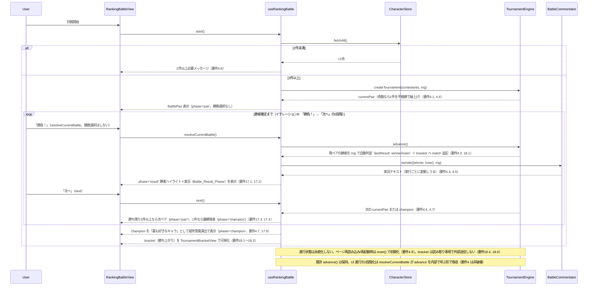
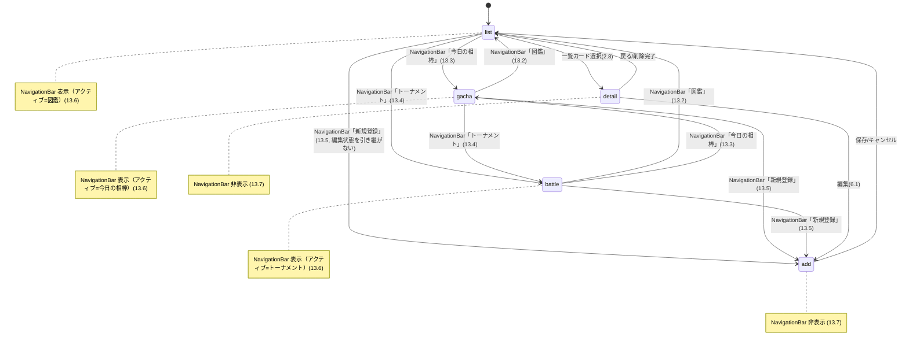

# Design Document

設計書

## Overview

概要

本設計書は、カップルが二人だけで楽しむ、iPhone のホーム画面に追加して使える **PWA（Progressive Web App）**「chara-collection（キャラ図鑑）」の技術設計を定義する。要件定義書（requirements.md、要件1〜要件15）に基づき、以下の3つの機能領域に「編集・削除」「見た目と使い勝手の底上げ（イテレーション5）」および「登録項目の拡張（イテレーション6）」を加えて実装する。

1. **キャラ図鑑（Character Collection）**: 写真付きキャラクターの登録・一覧表示・詳細表示・編集・削除（要件1, 2, 6）
2. **今日の一枚ガチャ（Daily Gacha）**: 同一暦日内で固定される「今日の相棒」のランダム選出と引き直し（要件5）
3. **ランキング対戦（Ranking Battle）**: 全キャラクターによる勝ち抜きトーナメント（不戦勝対応）で一番のお気に入りを自動判定して決定（要件4）。各対戦の勝者は利用者が選ぶのではなく、**Chara_App がランダム要素を含めてちょうど1件を自動判定**する。対戦の様子・勝敗は、実行のたびにランダムに変わる **Battle_Commentary（それっぽい実況テキスト）** として表示し、同一の組み合わせでも**実行ごとに勝者・実況が変動**しうる。

### イテレーション5（見た目と使い勝手の底上げ、要件9〜13）

イテレーション5では、既存機能のデータモデル（`Character` 型）を変更せずに、UI の質と使い勝手を底上げする。具体的には、(a) 落ち着いたパステルを基調に上品なアクセント・洗練された余白/影/フォント/トランジションを備えた **大人かわいいテーマ（Adult_Cute_Theme）** を全画面へテーマトークン経由で適用し（要件9）、(b) 一覧では **ニックネームを主表示** として優先し名前を副表示に回すニックネーム優先表示を行い（要件10）、(c) 一覧を「登録日時の新しい順」「Favorite_Level の高い順」「名前の昇順」で **並び替え** できるようにし（要件11）、(d) お気に入り度を塗り記号 5 個中 N 個＋テキスト等価物「5段階中N」で **視覚的に強調** し（要件12）、(e) 「図鑑／今日の相棒／トーナメント／新規登録」へ素早く行き来できる画面下部固定の **共通ナビゲーションバー（Navigation_Bar）** を追加する（要件13）。これらはいずれも既存の `Character` データで成立し、並び替え・表示・ナビは既存データを読むだけで実現する。

### イテレーション6（登録項目の拡張、要件14〜15）

イテレーション6では、`Character` に**任意の2フィールドを追加**して登録項目を拡張する。具体的には、(a) そのキャラと「出会った日」を任意（未設定可）で登録し、詳細画面でのみ表示する **Met_On（出会った日）**（要件14）と、(b) 大人かわいいテーマのトークン由来のパステルのプリセットから選ぶ **Image_Color（イメージカラー）** を登録し、一覧カードの枠および詳細の写真枠の縁取りへ反映する機能（要件15）を追加する。

このイテレーションは既存機能への**破壊的でない拡張**として設計する。要点は次のとおり。

- **データモデル拡張（後方互換が最重要）**: `Character` に `metOn?: string`（ISO 8601 の `YYYY-MM-DD`。未設定は `undefined`）と `imageColor: ImageColor`（プリセット列挙。既定は `'none'`）を追加する。これらの属性を持たない旧データは、`IndexedDbCharacterStore.fetchAll` の読み出し時に既存の `PhotoData` 正規化と同じ場所で正規化して吸収する（`metOn` 無し → `undefined`、`imageColor` 無し/不正値 → `'none'`）。**DB バージョンやスキーマ変更は不要**（新規プロパティの追加のみで、既存レコードは読み出し時正規化で後方互換を保つ、要件14.11, 15.5）。
- **ドメイン純粋関数の追加（PBT 対象）**: 出会った日の入力/旧データを妥当な `metOn` か `undefined` へ正規化する `normalizeMetOn`、イメージカラーから縁取り適用有無と参照トークン名を導く `deriveImageColorStyle`、詳細表示用の整形 `formatMetOn` を追加する。意思決定ロジックは従来どおり Domain 層の純粋関数へ寄せ、property-based testing で検証する。
- **UI 反映**: `RegistrationForm` に「出会った日」（`<input type="date">`・任意）と「イメージカラー」（なし＋5色の6択）の入力 UI を追加し、`CharacterCard`・`CharacterDetailView` は `imageColor` に応じた縁取りをトークン経由で適用する。`CharacterDetailView` は `metOn` 設定時のみ「YYYY年M月D日」で表示する。`Collection_View`・`Daily_Gacha`・`Ranking_Battle` には `metOn` を表示しない（要件14.7, 14.8）。
- **不変の制約の維持**: `metOn`・`imageColor` を含む一切のデータを外部サーバーへ送信しない（要件3.8, 14.12, 15.11）。縁取りは大人かわいいテーマのトークン経由で適用し、角丸・横スクロールなし・44×44 CSS px タッチ領域を維持する（要件15.9, 15.10）。

### イテレーション8（今日の相棒に一言、要件16）

イテレーション8では、今日の一枚ガチャ（Daily_Gacha）で選出された「今日の相棒」に併記する短いメッセージを、**相棒キャラ本人のセリフ風の一言（Daily_Line）** に置き換える。既存機能への**破壊的でない拡張**として設計し、要点は次のとおり。

- **既存メッセージの置き換え（別枠追加ではない）**: 要件5.5 の「最大50文字の短いメッセージ」の枠をそのまま使い、その内容を「選出された相棒キャラ本人のセリフ風の一言」に変更する。`DailyGachaView` ではこの一言を吹き出し風に表示する（表示のみの変更で、ロジックは持たない）。
- **ドメイン純粋関数として決定的に選ぶ**: 既存の `buildDailyMessage(name)`（名前を埋め込む固定定型文）を、**決定的にセリフを選ぶ関数へ作り替える**。決定性は既存 `DailyPickSelector`（FNV-1a 系の決定的ハッシュ + 暦日 + salt）と同じ思想に揃え、暦日（`CalendarDay`）と相棒の id（および現在の salt）から複数のセリフテンプレート集の 1 つを決定的に選ぶ。これにより同一暦日・同一相棒・同一 salt では再オープンしても同一の一言になり（要件16.2、要件5.2 と整合）、引き直し（salt 変更）で相棒や salt が変われば一言も変わりうる（要件16.3、要件5.3 と整合）。
- **50文字上限の維持**: 一言の長さは常に最大50文字（Unicode コードポイント数）以下を保証する（要件16.4、要件5.5、Correctness Property 16 を維持）。名前が空でも成立するテンプレートを含め、空でない一言を返す（要件16.6）。
- **不変の制約の維持**: Daily_Line は端末内で決定的に生成し、いかなる外部サーバーへも送信しない（要件16.5、要件3.8）。意思決定ロジックは従来どおり Domain 層の純粋関数へ寄せ、property-based testing で検証する（Correctness Property 23）。

### イテレーション9（対戦を魅せる、要件17〜18）

イテレーション9では、ランキング対戦（Ranking_Battle）を **試合ごとのリザルト表示・演出** と **勝ち上がりを可視化するトーナメント表（Tournament_Bracket）** で魅せる。既存機能への**破壊的でない拡張**として設計し、要点は次のとおり。

- **非破壊拡張（要件4 は不変）**: 要件4 の文言・セマンティクスは改定しない。要件4.2（rng 自動判定）・4.6（不戦勝）・4.7（勝者1件で終了）を維持したまま、各対戦に **結果発表フェーズ（Battle_Result_Phase）** を挟み、利用者の操作（「勝負！」→「次へ」）で進行を2段階に分ける拡張として整理する（要件17）。自動再生・効果音・総評（トーナメント全体の講評テキスト）は**いずれも不採用**とする。
- **TournamentEngine の拡張（既存セマンティクス不変）**: `TournamentEngine` を**勝ち上がり履歴（bracket）の公開のため拡張**する。読み取り専用の `readonly bracket: TournamentBracket` を追加し、`advance()` が現ペアの勝敗確定時に確定した match（勝者を含む）を bracket へ追記し、不戦勝も match として記録する。既存の `currentPair` / `champion` / `lastResult` / `advance()` の**セマンティクスは不変**であり、`createTournament` のファクトリ仕様も変えない。bracket は追加的な読み取り専用情報であるため、既存の Correctness Property 11・12・13 は**不変で保持**する（新たに bracket の正当性を検証する Property 24 を追加する）。
- **UI 進行の2段階化（useRankingBattle）**: `useRankingBattle` に対戦フェーズ状態（`phase: 'pair' | 'result' | 'champion'`）を持たせ、`resolveCurrentBattle()`（現ペアの勝者を確定し結果発表フェーズへ＝「勝負！」。内部で `engine.advance()` を呼ぶ）と `next()`（次ペア／優勝へ進む＝「次へ」）へ操作を分割する。さらに表示用に id を Character へ解決した `bracket` を公開する。既存の `advance()` の設計記述は保持し、UI 進行の2段階化は `advance()` を「勝負！」時に内部で呼ぶ形で吸収する。
- **演出は UI/CSS 中心（トークン経由・reduced-motion 尊重）**: 勝者ハイライト・ペア入場のトランジション・優勝の紙吹雪風演出は `RankingBattleView` と CSS（`global.css` の keyframes）で実装し、色/角丸/影/余白/トランジションはすべて大人かわいいテーマのトークン（`--transition-*` は 200〜500ms、`--color-*` / `--radius-*` / `--shadow-*` / `--space-*`）経由で適用する。`@media (prefers-reduced-motion: reduce)` では無効化/短縮する（要件17.7, 17.8, 要件9.4, 9.5）。
- **Tournament_Bracket の可視化（読み取り専用）**: 勝ち上がりを可視化する新規サブコンポーネント `TournamentBracketView` を追加する。ブラケットは id ベースで保持し、表示側で名前/写真へ解決する。ビューポート幅 320〜430 CSS px でも横スクロールを発生させないレイアウト（縦積み/折り返し等）とし、操作要素は最小 44×44 CSS px を維持する（要件18.5, 17.10, 17.11）。
- **不変の制約の維持**: Tournament_Bracket を含む一切のデータを外部サーバーへ送信しない（要件18.6、要件3.8）。bracket の保持・公開は Domain 層の `TournamentEngine`（純粋・rng 注入）で行い、property-based testing で検証する（Correctness Property 24）。

### イテレーション10（対戦をもっと楽しく、要件19〜21）

イテレーション10では、ランキング対戦（Ranking_Battle）を **状況別の実況**・**準優勝/ベスト4 の表示**・**対戦のお題（Battle_Theme）** の3点で盛り上げる。既存機能への**破壊的でない拡張**として設計し、**`TournamentEngine` の勝敗判定は一切変更しない（勝率は 50/50 のまま）**。要点は次のとおり。

- **状況別の実況（要件19）**: `BattleCommentator` を、対戦の**状況区分 Battle_Situation**（`'favored'`＝順当／`'upset'`＝番狂わせ／`'even'`＝互角）を受け取れるよう拡張する。`type BattleSituation = 'favored' | 'upset' | 'even'` を追加し、状況別の実況テンプレート群から選ぶ。状況は「勝者と敗者の Favorite_Level の比較」から呼び出し側（`useRankingBattle`）が導出（`deriveBattleSituation`）して渡す。勝敗そのものは従来どおり rng で 50/50（重みづけはしない、要件19.4, 4.2）。既存の `narrate(pair, rng)` シグネチャは**後方互換を保つ**（`narrate(pair, rng, situation?)` の省略可能引数として追加。省略時は従来相当の汎用テンプレート）。既存 Property 14（非空・勝者名を含む・rng で変動）は拡張後も維持する。
- **準優勝・ベスト4 の表示（要件20）**: 優勝発表（`champion`）画面に、準優勝（決勝＝最終ラウンドの敗者）と、存在すればベスト4（準決勝＝最終ラウンドの1つ前のラウンドの敗者たち）を `bracket` から導出して表示する。導出は純粋関数 `deriveRanking(bracket, championId): { runnerUp: string | null; semifinalists: string[] }` として切り出し PBT 可能にする。エンジンは変更せず表示のみ（読み取り専用、要件20.4, 18.4）。参加者が少なく定義できない順位は該当分のみ表示（`runnerUp` は `null`、`semifinalists` は空配列、要件20.3）。
- **対戦のお題（Battle_Theme、要件21）**: 対戦開始（`start`）のたびに rng でお題（例「かわいい選手権」「たよれる度No.1決定戦」等の短い文言）を1つ選び、対戦画面に表示し、実況にも軽く反映できるようにする。お題選択は純粋関数 `pickBattleTheme(rng): string` として切り出す（お題テンプレート配列を持つ）。毎回ランダム（決定的固定はしない、要件21.1, 21.2）。お題は端末内で選び外部送信しない（要件21.3, 3.8）。
- **不変の制約の維持**: `TournamentEngine` の勝敗判定・終了性・不戦勝・bracket セマンティクスは不変（既存 Property 11〜13, 24 を保持）。Battle_Theme を含む一切のデータを外部送信しない（要件21.3, 3.8）。実況・お題・順位表示はいずれも Domain 層の純粋関数（`deriveBattleSituation` / `deriveRanking` / `pickBattleTheme` / `narrate` 拡張）へ寄せ、property-based testing で検証する（Correctness Property 25〜27）。表示は大人かわいいテーマのトークン経由で適用し、横スクロールなし・44×44 CSS px を維持する（要件21.4, 21.5, 9）。

### イテレーション11（トーナメント表を図に、要件18 の表示強化）

イテレーション11では、イテレーション9で追加した `TournamentBracketView`（勝ち上がりの読み取り専用可視化、要件18）を、現状の「ラウンドごとに対戦を縦積みしたリスト表示」から **接続線つきの縦向きブラケット図** へ作り替える。これは **UI/CSS 中心の表示強化** であり、**データモデル・ドメイン・`TournamentEngine` は一切変更しない**破壊的でない拡張として設計する。要点は次のとおり。

- **表示強化のみ（データ/エンジン/ドメイン不変）**: `ResolvedBracketMatch` / `TournamentBracket` / `BracketMatch` のデータ形状、`useRankingBattle` の `bracket` 公開、`TournamentEngine` のブラケット記録ロジックはいずれも変更しない。`TournamentBracketView` の props（`matches: ResolvedBracketMatch[]`・`winnerHighlightId?: string | null`）も不変とし、描画（JSX/クラス構造）と CSS のみを更新する。既存 Correctness Property（特に bracket 整合の Property 24）は不変で保持する。
- **縦向きブラケット図**: ラウンド（`round` 昇順）を上から下へ縦積みし、各対戦を「対戦カード（2者＋勝者強調、不戦勝は Bye 表記）」として表す。**各対戦の勝者が次ラウンド（下）の対戦へ接続線でつながる**ことを図示する。接続線は CSS（罫線／擬似要素 `::before`・`::after`）または軽量な自前描画（追加ライブラリなし）で描く。
- **横スクロール一切なし（要件7.6, 9.7, 18.5, 18.7）**: ビューポート幅 320〜430 CSS px でも、画面全体・図コンテナともに横スクロールを出さない。ラウンドを縦積みにして対戦カードを画面幅に収め、長い名前は折り返す。図が縦に長い場合は画面の縦スクロールで対応する。
- **勝者ハイライト・Bye・優勝強調の維持**: 勝者側の強調（`👑`・`--winner`）、不戦勝（Bye）表記、`winnerHighlightId`（最終優勝者）の軽い強調（`--champion`）は維持する。読み取り専用（操作要素を置かず対戦結果やデータを変更しない、要件18.4）を守り、操作要素があれば最小 44×44 CSS px を維持する。
- **トークン経由・reduced-motion 尊重**: 配色・角丸・影・余白、および接続線の色はすべて大人かわいいテーマのトークン（`--color-*` / `--radius-*` / `--shadow-*` / `--space-*`、接続線は例えば `--color-border` / `--color-accent` 相当のトークン）経由で適用する。もしトランジションを用いる場合は `--transition-*`（200〜500ms）経由とし、`@media (prefers-reduced-motion: reduce)` で無効化/短縮する（要件9.4, 9.5）。

### 技術方針

- **プラットフォーム**: Web（PWA）。iPhone Safari でホーム画面に追加し、スタンドアロン・ポートレートで起動する（要件7.1, 7.2）。オフラインファースト設計とする。
- **フレームワーク / 言語 / ビルド**: React + TypeScript + Vite（要件7.1）。
- **PWA 化**: `vite-plugin-pwa` により Web App Manifest と Service Worker を生成する。Service Worker がアプリシェルをプリキャッシュし、初回読み込み以降はオフラインで各機能を提供する（要件3.4, 3.5, 7.2, 7.3）。
- **永続化**: 端末内の **IndexedDB**。写真は **ArrayBuffer(バイト列)+MIME** として保存する（`PhotoData`）。IndexedDB に Blob/File を直接保存すると iOS WebKit の既知バグ（`UnknownError: Error preparing Blob/File data to be stored in object store`）で保存に失敗するため、ArrayBuffer として保存する。IndexedDB の薄いラッパとして `idb` ライブラリを用いる（実装詳細）。サーバー同期・外部送信は一切行わない（要件3.1, 3.3, 3.8）。
- **写真取得**: HTML の `<input type="file" accept="image/*">` を用いる。モバイルでは `capture` 属性でカメラ起動を要求できる（要件1.2）。
- **UI**: パステルカラー基調・角丸多用のかわいくポップなデザインを **CSS（CSS カスタムプロパティ／トークン）** で実現する。重量級 UI フレームワークは用いない（要件7.4, 7.5）。
- **状態管理**: React の state + hooks を基本とし、小さなストア／コンテキスト層を許容する。ドメインロジックはフレームワーク非依存の**純粋 TypeScript モジュール**として切り出し、テスト容易性（property-based testing）を確保する。

### 開発環境に関する注記

本アプリは Web 技術（React / TypeScript / Vite / IndexedDB / PWA）のみで構成される。したがってビルド・実行・テストはすべて **Windows 環境で完結**する。macOS や Xcode は不要である。iPhone 実機での確認は、同一 LAN 上の Vite 開発サーバーへ Safari からアクセスするか、ビルド成果物を配信して行う（本番配信の詳細は本設計の範囲外）。

## Architecture

アーキテクチャ

### レイヤー構成

「UI（React コンポーネント）／ hooks + view-state（画面状態・ビューモデル相当）／ domain（純粋 TS）／ persistence（IndexedDB）／ PWA 基盤」に分離する。ドメインロジック（入力バリデーション、決定的な今日の一枚選出、トーナメント、写真処理）を UI・永続化から独立させることで、property-based testing を含む自動テストを可能にする。



### レイヤーごとの責務

- **UI 層（React コンポーネント）**: 画面描画とユーザー操作の受け取りのみ。状態は hooks から受け取り、ロジックを持たない。大人かわいいテーマ（Adult_Cute_Theme）の配色・角丸・影・余白・トランジション（`prefers-reduced-motion` 尊重）・rem による文字サイズ追従・44×44 CSS px のタッチ領域・横スクロールなしのレスポンシブはここで担保する（要件7.4〜7.8, 要件9）。ルートの `App` が現在のビュー状態（`'list' | 'add' | 'detail' | 'gacha' | 'battle'`）を保持し、共通の `NavigationBar`（下部固定タブ）を管理する。`NavigationBar` は主要画面（`list`/`gacha`/`battle`）でのみ表示し、詳細（`detail`）と登録/編集フォーム（`add`）では表示しない（要件13.6, 13.7）。一覧カードの主表示/副表示やお気に入り度の記号表示は Domain 層の純粋関数（`deriveCardDisplay` 等）が返す表示モデルに基づき描画する（要件10, 12）。
- **Hooks + View-State 層**: 画面状態（ローディング／エラー／入力値）の保持と、ユースケースの調停。React hooks（`useState` / `useEffect` / `useReducer`）で実装し、Domain 層と Persistence 層を呼び出す。MVVM の ViewModel に相当する責務を担う（本設計では「MV 的分離」と呼ぶ）。
- **Domain 層（純粋 TypeScript）**: 副作用を持たないフレームワーク非依存のモジュール。`CharacterValidator`（バリデーション）、`sortCharacters`（Sort_Order に基づく決定的な並び替え、要件11）、`deriveCardDisplay`（一覧カードの主表示/副表示の導出、要件10）、お気に入り度表示モデル導出（塗り記号個数＋テキスト等価物、要件12）、`normalizeMetOn`（出会った日の正規化、要件14）、`formatMetOn`（出会った日の表示整形、要件14）、`deriveImageColorStyle`（イメージカラーからの縁取り導出、要件15）、`DailyPickSelector`（決定的選出）、`TournamentEngine`（トーナメントの勝者自動判定）、`BattleCommentator`（実況テキスト生成）、`PhotoProcessor`（画像形式・サイズ検証と正規化）。React にも IndexedDB にも依存しないため、単体テストと property-based testing の主対象となる。乱数を用いる `TournamentEngine`・`BattleCommentator` も、乱数生成器（rng）を外部注入することで純粋性・決定的テスト容易性を保つ。`sortCharacters` は入力配列を変更せず新しい配列を返す純粋関数として、`deriveCardDisplay`・お気に入り度表示モデル導出も入力から表示値を導く純粋関数として実装する（要件11.5）。
- **Persistence 層**: `CharacterStore` インターフェースで永続化を抽象化し、既定実装は `IndexedDbCharacterStore`（`idb` 経由）。テスト時は `InMemoryCharacterStore` に差し替える。すべての操作は非同期（`Promise`）。
- **PWA 基盤**: `vite-plugin-pwa` が生成する Service Worker（アプリシェルのプリキャッシュ／オフライン提供）と Web App Manifest（ホーム画面追加）。写真取得の `<input type="file">`、およびガチャの salt を保持する `localStorage` もこの層に属する。

### MV 的分離とドメイン純粋化の理由

React コンポーネント（View）と hooks（View-State）を分離し、意思決定ロジックを純粋 TypeScript のドメインモジュールへ寄せる。これにより、ガチャの決定性・トーナメントの終了性・入力検証といった中核ロジックを、DOM やブラウザ API（IndexedDB, Service Worker, File API）から切り離してテストできる。純粋関数は fast-check による property-based testing に直接かけられ、100 回以上のランダム入力で普遍的性質を検証できる。

### 主要な設計判断とその根拠

| 判断 | 根拠 |
| --- | --- |
| React + TypeScript + Vite | 要件7.1 で指定。型安全・高速な開発サーバー・軽量ビルド。Windows で完結。 |
| PWA（vite-plugin-pwa） | 要件7.2, 7.3。Manifest + Service Worker をビルド時に生成し、ホーム画面追加とオフラインを実現。 |
| IndexedDB + `idb`（写真は ArrayBuffer+MIME） | 要件3.1, 3.3。大容量バイナリを扱える端末内ストア。写真は Blob/File ではなく ArrayBuffer で保存（iOS WebKit の Blob 保存バグ回避）。`idb` は薄い Promise ラッパで実装を簡潔化。 |
| `CharacterStore` インターフェース抽象 | 実装（IndexedDB）とテスト（インメモリ）を差し替え可能にするため。 |
| ドメインロジックの純粋 TS 化 | property-based testing（決定的選出・トーナメント・バリデーション・並び替え・表示モデル導出）を成立させるため。 |
| `App` ルートで view-state を集中管理し `NavigationBar` を制御 | 要件13.6, 13.7。主要画面（list/gacha/battle）のみ下部タブを表示し、詳細・登録/編集では非表示にする表示制御を単一箇所に集約するため。 |
| 並び替え・表示テキストを純粋関数へ分離（`sortCharacters` / `deriveCardDisplay` / お気に入り度表示モデル） | 要件10, 11, 12。表示順・表示テキスト・記号個数を決定的な純粋関数として切り出し、property-based testing 可能にするため。並び替えは表示順のみでストア/データ不変（要件11.5）。 |
| ArrayBuffer 保存 + Object URL 表示 | 保存は ArrayBuffer+MIME。表示時に `new Blob([data], { type })` で Blob を都度生成し `URL.createObjectURL` で表示、不要時に `revokeObjectURL` で解放しメモリリークを防ぐ。 |
| `metOn` / `imageColor` を任意追加し読み出し時正規化で後方互換（DB バージョン据え置き） | 要件14, 15。新規プロパティ追加のみでスキーマ変更を伴わないため、`fetchAll` 読み出し時に欠落/不正を既定値（`undefined` / `'none'`）へ正規化すれば旧データを破壊せず拡張できる（要件14.11, 15.5, 3.8）。意思決定は純粋関数（`normalizeMetOn` / `deriveImageColorStyle`）へ寄せ PBT 対象とする。 |

## Components and Interfaces

コンポーネントとインターフェース

### React コンポーネント

#### CollectionView（図鑑一覧）

登録済み Character を、現在選択中の `Sort_Order` に従って一覧表示する。初期状態（未選択）は名前の昇順（要件11.4 と同一の順序。要件2.1, 11.2）。各カードは写真・主表示/副表示（ニックネーム優先、要件10）・お気に入り度の視覚表現（要件12）を表示する（要件2.3, 2.5, 2.6）。0 件時は空状態メッセージと新規登録導線を表示（要件2.7, 8.6）。写真読み込み失敗時は当該カードのみプレースホルダー表示にフォールバックし、他カードの表示は継続する（要件2.4）。ストア読み込み失敗時は再試行手段を提示（要件2.9）。

一覧の先頭に、大人かわいいテーマに沿った **並び順の選択 UI**（セグメント/ドロップダウン等。各操作要素は最小 44×44 CSS px、横スクロールなし）を配置し、左から「名前の昇順」→「Favorite_Level の高い順」→「出会った日の新しい順」の3種を切り替える（「登録日時の新しい順」は UI の選択肢に含めない。要件11.1, 11.7, 9.6, 9.7, 13 と整合）。並び替えは表示順のみを変更し、Character_Store のデータおよび Character の内容は変更しない（要件11.5）。なお「出会った日の新しい順」は並び替えキーに Met_On を用いるのみで、一覧カードに Met_On を表示するわけではない（Met_On は詳細画面のみ表示、要件14.7）。

```tsx
function CollectionView(): JSX.Element {
  const { characters, sortOrder, setSortOrder, loadState, reload } = useCollection();
  // 並び順選択 UI（name/favorite/metOn の3種、初期 name）、grid/list、empty-state、retry-on-error を分岐表示
  // 各カードは deriveCardDisplay(character) の主表示/副表示と FavoriteLevelDisplay を描画
}
```

#### CharacterDetailView（詳細）

選択された Character の写真・名前・ニックネーム・メモ・お気に入り度を表示する（要件2.8）。詳細画面の表示順は従来どおり（名前・ニックネームの順序を一覧のニックネーム優先とは独立に維持）とし、要件10 のニックネーム優先は一覧カードにのみ適用する（要件10.1〜10.4 は Collection_View 対象）。お気に入り度は一覧カードと同一の視覚表現（塗り記号 5 個中 N 個＋テキスト等価物「5段階中N」）を `FavoriteLevelDisplay` で表示する（要件12.2）。編集・削除の導線を提供（要件6）。削除時は確認ダイアログを表示し、キャンセル時は元表示に戻す（要件6.5, 6.6, 6.7）。

**イテレーション6の追加表示（要件14, 15）**:

- **出会った日（Met_On）**: `metOn` が設定済み（`normalizeMetOn` を通過した妥当な `YYYY-MM-DD`）の場合のみ、`formatMetOn(metOn)` の結果「YYYY年M月D日」を詳細画面に表示する（要件14.5）。未設定の場合は当該行自体を表示しない（要件14.6）。この表示は詳細画面（`CharacterDetailView`）に限り、一覧・ガチャ・対戦には出さない（要件14.7, 14.8）。
- **イメージカラー（Image_Color）の縁取り**: `deriveImageColorStyle(character.imageColor)` の結果に基づき、写真枠に縁取りをトークン経由で軽く反映する。`hasBorder === true` のときのみ `borderVarName`（例 `--image-color-rose`）を `border-color` に用い、`'none'`（`hasBorder === false`）のときは縁取りを一切適用しない（要件15.7, 15.8）。角丸（`--radius-large`）は維持する（要件15.9）。

#### RegistrationForm（登録 / 編集）

新規登録と編集の双方に用いる（要件1, 要件6.1）。入力欄: 名前（0〜50 文字・任意、要件1.4, 1.9）、ニックネーム（0〜50 文字、要件1.5）、メモ（0〜500 文字、要件1.6）、お気に入り度（1〜5、要件1.7）、写真取得（`PhotoInput`、要件1.2）。編集時は既存属性を初期表示（要件6.1）し、写真を差し替え可能（要件6.4）。写真未指定確定時・不正画像時・保存失敗時・ファイル選択キャンセル/ブロック時は入力内容を保持したままメッセージを表示（要件1.3, 1.10, 1.11, 1.12, 8.2〜8.5）。

**イテレーション6の追加入力欄（要件14, 15）**:

- **出会った日（Met_On）**: `<input type="date">` による任意項目（未入力可、要件14.1）。編集時は既存 `metOn` が設定済みなら当該日付を初期値に表示し、未設定なら空欄で表示する（要件14.9）。入力欄をクリア（空）にして確定すると `metOn` を未設定へ更新する（要件14.10）。妥当な暦日として解釈できない値は `normalizeMetOn` により未設定へ落とす（要件14.4）。各操作要素は最小 44×44 CSS px・横スクロールなし・大人かわいいテーマ整合を維持する（要件15.10, 要件9）。
- **イメージカラー（Image_Color）**: 「なし」＋プリセット5色の**6択**選択 UI（各色をパステルのスウォッチ等で提示、要件15.1）。既定選択は `'none'`（要件15.2）。編集時は既存 `imageColor` を初期選択にする。各選択肢は最小 44×44 CSS px のタッチ領域を持たせる（要件15.10）。選択値は `ImageColor` として `draft.imageColor` に保持する。

#### DailyGachaView（今日の一枚ガチャ）

「今日の相棒」を写真・名前・短いメッセージ（最大50文字）とともに表示（要件5.4, 5.5）。引き直しボタンを提供（要件5.3）。0 件時は登録を促す（要件5.6）。

**イテレーション8の変更（要件16）**: 併記する短いメッセージは、相棒キャラ本人のセリフ風の一言（Daily_Line）とし、**吹き出し風**に表示する（要件16.1）。この一言は `useDailyGacha` の `message` として受け取り、本コンポーネントはロジックを持たず受け取った文字列を描画するのみとする（Daily_Line の決定的選出・50文字保証は Domain 層の純粋関数が担う）。吹き出しの見た目は大人かわいいテーマのトークン経由で適用し、44×44 CSS px・横スクロールなしを維持する（要件9）。

#### RankingBattleView（ランキング対戦）

現在の `BattlePair` 2 件を並べて表示する（要件4.1）。勝敗は利用者が選ぶのではなく、**Chara_App が自動的に勝者を判定**し、ランダムに変わる実況（`Battle_Commentary`）と勝敗結果を表示する（要件4.2, 4.3）。利用者の操作は対戦を進めるための「開始」「勝負！」「次へ」のみで、**勝敗の選択は行わない**。各対戦の実況表示後、勝者を次ラウンドへ進め、勝ち残りが 2 件以上ある間は次の `BattlePair` を提示する（要件4.4）。同一の組み合わせでも実行ごとに勝者・実況が変動しうる（要件4.5）。最終的に勝者 1 件を「最も好きなキャラ」として表示（要件4.7）。2 件未満なら開始せずメッセージ表示（要件4.8）。ページ再読み込み時は進行状態を破棄して初期化する（要件4.9）。

**イテレーション9の追加（対戦を魅せる、要件17, 18）**:

- **試合ごとの結果発表フェーズ（Battle_Result_Phase）**: `useRankingBattle` の `phase`（`'pair' | 'result' | 'champion'`）に従い表示を切り替える。`'pair'` ではペア 2 件と「勝負！」ボタン（`resolveCurrentBattle` を呼ぶ）を表示し、`'result'` では**勝者ハイライト**（勝者側を強調表示）と `Battle_Commentary` を表示し「次へ」ボタン（`next` を呼ぶ）を出す（要件17.1, 17.2）。対戦は自動再生せず、これら2操作でのみ進行する（要件17.5）。効果音は用いない（要件17.6）。
- **ペア入場・勝者ハイライトのトランジション**: ペア入場と勝者ハイライトに 200〜500ms の視覚的トランジション/アニメーションを大人かわいいテーマのトークン（`--transition-*`）経由で適用し、`prefers-reduced-motion: reduce` では無効化/短縮する（要件17.7, 17.8, 9.4, 9.5）。
- **優勝の紙吹雪風演出**: `phase === 'champion'` のとき、勝者 1 件を大きく強調した優勝発表を**紙吹雪風の演出**（`global.css` の keyframes・トークン経由）付きで表示する（要件17.9, 4.7）。`prefers-reduced-motion` では紙吹雪を無効化/短縮する（要件17.8）。
- **`TournamentBracketView`（サブコンポーネント。イテレーション11で接続線つき縦向きブラケット図へ強化）**: `useRankingBattle` の `bracket`（`ResolvedBracketMatch[]`）を受け取り、勝ち上がり（各ラウンドの対戦ペア・勝者・不戦勝）を可視化する（要件18.1〜18.3）。表示（読み取り専用）のみで対戦結果やストアを変更しない（要件18.4）。props は `matches: ResolvedBracketMatch[]`・`winnerHighlightId?: string | null` で**不変**とする。**イテレーション11の表示強化（要件18.7）**: 描画方針を「ラウンドごとに対戦を縦積みしたリスト」から **接続線つきの縦向きブラケット図** へ作り替える。ラウンド（`round` 昇順）を上から下へ縦積みし、各対戦を「対戦カード（2者＋勝者強調 `--winner`・不戦勝は Bye 表記）」として表し、**各対戦の勝者を次ラウンド（下）の対戦へ接続線でつなぐ**。接続線は CSS 罫線／擬似要素（`::before`・`::after`）または軽量な自前 SVG（追加ライブラリなし）で描き、色はトークン（`--color-border` / `--color-accent` 相当）経由で解決する。ビューポート幅 320〜430 CSS px でも**画面全体・図コンテナともに横スクロールを発生させない**（縦積み・長い名前は折り返し・縦に長い場合は画面の縦スクロールで対応、要件18.5, 18.7, 7.6, 9.7）。勝者ハイライト・Bye 表記・`winnerHighlightId`（最終優勝者）の軽い強調（`--champion`）を維持し、操作要素があれば最小 44×44 CSS px を維持する（要件17.10, 17.11）。配色・角丸・影・余白・接続線色は大人かわいいテーマのトークン経由で適用し、トランジションを用いる場合は `--transition-*`（200〜500ms）・`prefers-reduced-motion` 尊重とする（要件9）。データモデル・`useRankingBattle`・`TournamentEngine` は変更しない（表示強化のみ、Property 24 は不変）。

**イテレーション10の追加（対戦をもっと楽しく、要件19, 20, 21）**:

- **お題（Battle_Theme）の表示（要件21）**: `useRankingBattle` の `theme: string`（`start` 時に `pickBattleTheme(rng)` で選出）を対戦画面の上部等に表示する。表示は大人かわいいテーマのトークン（`--color-*` / `--radius-*` / `--shadow-*` / `--space-*`）経由で適用し、ビューポート幅 320〜430 CSS px でも横スクロールを発生させない（要件21.4, 21.5, 9）。本コンポーネントはロジックを持たず、hook から受け取った `theme` を描画するのみとする（お題選択は Domain の `pickBattleTheme` が担う）。
- **状況別の実況（要件19）**: `currentCommentary`（`BattleOutcome`）の実況文は、`useRankingBattle` が勝者・敗者の Favorite_Level から `deriveBattleSituation` で導いた状況（favored/upset/even）を `narrate(names, rng, situation)` へ渡して生成する。本コンポーネントは受け取った実況文字列を描画するのみで、状況の導出ロジックは持たない（要件19.2, 19.3）。
- **準優勝・ベスト4 の表示（要件20）**: `phase === 'champion'` の優勝発表画面に、`useRankingBattle` が公開する `runnerUp: Character | null`（準優勝）と `semifinalists: Character[]`（ベスト4）を表示する。`runnerUp` が `null` の場合は準優勝行を表示せず、`semifinalists` が空の場合はベスト4行を表示しない（参加者が少なく定義できない順位は非表示、要件20.1, 20.2, 20.3）。表示はトークン経由・横スクロールなし・44×44 CSS px を維持する（要件9）。

#### App（ルート・ビュー状態と NavigationBar 制御）

アプリのルートコンポーネント。現在のビュー状態 `view: 'list' | 'add' | 'detail' | 'gacha' | 'battle'`（および `detail`/`add` の対象 Character・編集フラグ）を保持し、対応する画面コンポーネントを描画する。共通の `NavigationBar` の表示可否と遷移を制御する。

- `NavigationBar` は主要画面（`view` が `'list'` / `'gacha'` / `'battle'`）でのみ表示し、`'detail'`（詳細）と `'add'`（新規登録・編集フォーム）では表示しない（要件13.6, 13.7）。
- 遷移ハンドラ: `goToList()`→`'list'`（要件13.2）、`goToGacha()`→`'gacha'`（要件13.3）、`goToBattle()`→`'battle'`（要件13.4）、`goToAdd()`→編集状態を持たない新規登録フォーム（`'add'`、`editing` をクリア、要件13.5）。
- アクティブタブは現在の `view`（`list`/`gacha`/`battle`）から導出して `NavigationBar` に渡す（要件13.6）。

```tsx
type View = 'list' | 'add' | 'detail' | 'gacha' | 'battle';

function App(): JSX.Element {
  const [view, setView] = useState<View>('list');
  const showNav = view === 'list' || view === 'gacha' || view === 'battle'; // 要件13.6, 13.7
  // goToList/goToGacha/goToBattle/goToAdd を NavigationBar に渡す
  // showNav が true のときのみ NavigationBar を描画し、現在の view をアクティブタブとして渡す
}
```

#### 再利用可能コンポーネント

- `CharacterCard`: 一覧カード。写真枠（角丸大）・主表示/副表示・お気に入り度を表示する。表示テキストは `deriveCardDisplay(character)` が返す `{ primary, secondary? }` に基づき、主表示を先頭かつ副表示より大きい文字サイズで表示し、副表示は主表示に続けて補助的に表示する（要件10.1〜10.4, 2.3, 2.5, 2.6）。お気に入り度は `FavoriteLevelDisplay` で表示（要件12.1）。写真デコード失敗時はプレースホルダー（要件2.4）。**イメージカラーの縁取り**は `deriveImageColorStyle(character.imageColor)` の結果に従い、`'none'` 以外のプリセット色のときのみカードの枠に `borderVarName`（`--image-color-*`）をトークン経由で適用し、`'none'` のときは縁取りなし（要件15.6, 15.8）。縁取りは角丸（`--radius-large`）を維持し、横スクロールなし・44×44 CSS px タッチ領域を崩さない（要件15.9, 15.10）。`metOn` は一覧カードには表示しない（要件14.7）。
- `FavoriteLevelPicker`: 1〜5 のお気に入り度**選択**（入力用。ハート等のかわいい表現、44×44 CSS px 以上、要件1.7, 7.7, 9.6）。
- `FavoriteLevelDisplay`: お気に入り度の**表示専用**コンポーネント（`FavoriteLevelPicker` の readOnly 表示に相当）。合計 5 個の記号のうち Favorite_Level と等しい個数を塗り記号、残りを未塗り記号で表示し、色/記号のみに依存せず度合いを判別できるテキスト等価物「5段階中N」を `aria-label` 等で提供する。範囲外/未設定/数値解釈不能は塗り 0 個・「5段階中0」で表示する（要件12.1〜12.4）。表示個数・テキスト等価物は純粋な表示モデル導出関数の結果を描画する。`CharacterCard` と `CharacterDetailView` の双方で用いる。
- `PastelButton`: 主要アクション用ボタン（大人かわいいテーマのアクセント・角丸中・最小 44×44 CSS px、要件7.5, 7.7, 9.2）。
- `EmptyStateView`: 空状態表示（要件2.7, 5.6, 8.6）。
- `PhotoFrame`: 角丸の写真表示枠。`PhotoData`（ArrayBuffer+MIME）を受け取り、表示時に Blob を生成して Object URL 化する。`onError` でプレースホルダー表示（要件2.4）。
- `PhotoInput`: `<input type="file" accept="image/*" capture="environment">` をラップし、選択・キャンセル・ブロックを扱う（要件1.2, 1.11）。
- `NavigationBar`: 画面下部に固定表示するタブ型の共通ナビゲーション。「図鑑」「今日の相棒」「トーナメント」「新規登録」の 4 項目を表示し、現在のビューに対応するタブをアクティブ表示する（要件13.1, 13.6）。各タブ項目は最小 44×44 CSS px のタッチ領域を持ち（要件13.8）、ビューポート幅 320〜430 CSS px の縦向きでも横スクロールを発生させずに 4 項目を配置する（要件13.9）。配色・角丸・トークンは大人かわいいテーマに整合させる（要件13.10, 要件9）。各タブは `App` が提供する遷移ハンドラ（`goToList` / `goToGacha` / `goToBattle` / `goToAdd`）を呼び出す（要件13.2〜13.5）。`goToAdd` は既存の編集状態を引き継がない新規登録用フォームを開く（要件13.5）。

### Hooks / View-State（ViewModel 相当）

```ts
type LoadState = 'idle' | 'loading' | 'loaded' | 'failed';

// 一覧（要件2, 11）
function useCollection(): {
  characters: Character[];      // 現在の sortOrder で並べ替えた表示順（sortCharacters の結果）
  sortOrder: SortOrder;         // 現在の並び順。初期値 'name'（名前の昇順。要件11.2）
  setSortOrder: (order: SortOrder) => void; // 表示順のみ変更、ストア/データは不変（要件11.5）
  loadState: LoadState;
  reload: () => Promise<void>;
  remove: (id: string) => Promise<void>;   // 要件6.7
};
// characters は fetchAll() の結果に sortCharacters(chars, sortOrder) を適用して返す。
// 並び替えは純粋関数 sortCharacters で行い、元データを変更しない（要件11.5, 11.6）。

// 登録/編集（要件1, 6）
function useRegistration(editing?: Character): {
  draft: CharacterDraft;                    // 入力保持用（失敗時も破棄しない）
  fieldErrors: FieldError[];
  setField: <K extends keyof CharacterDraft>(k: K, v: CharacterDraft[K]) => void;
  pickPhoto: (files: FileList | null) => Promise<void>;  // キャンセル/ブロック/不正を扱う
  save: () => Promise<SaveResult>;          // 'saved' | 'invalid' | 'storeError'
};

// 今日の一枚ガチャ（要件5, 16）
function useDailyGacha(): {
  partner: Character | null;
  message: string;                          // 相棒キャラ本人のセリフ風の一言（Daily_Line）。<= 50 文字（要件5.5, 16.1, 16.4）
  loadToday: () => Promise<void>;           // 同一暦日は固定
  reroll: () => Promise<void>;              // salt をインクリメント
};
// message（Daily_Line）は、選出された相棒（id/name）・当日暦日（today）・現在の salt を
// buildDailyLine へ渡して決定的に生成する（要件16.2, 16.3）。selectWithSalt 内で pick により
// 相棒を確定した後、その id/name と today・salt で buildDailyLine を呼び message に反映する。
// 名前が空でも成立し、常に 50 文字以下の空でない一言を返す（要件16.6, 16.4, 5.5）。

// ランキング対戦（要件4）— 勝敗はアプリが自動判定する（利用者の勝敗選択なし）。
// イテレーション9（要件17, 18）で、UI 進行を「勝負！」→「次へ」の2段階に分け、結果発表フェーズと
// トーナメント表（bracket）の公開を追加する（既存 start/advance/reset の互換に配慮した非破壊拡張）。
function useRankingBattle(): {
  currentPair: BattlePair | null;           // 現在提示中の対戦ペア（要件4.1）
  currentCommentary: BattleOutcome | null;  // 直近の対戦の実況 + 勝敗結果（要件4.2, 4.3）
  champion: Character | null;               // 勝ち残り1件確定時（要件4.7）
  canStart: boolean;                         // 2 件以上か（要件4.8）
  phase: 'pair' | 'result' | 'champion';    // 対戦フェーズ（イテレーション9、要件17）。pair=ペア提示中/result=結果発表中/champion=優勝発表
  bracket: ResolvedBracketMatch[];          // 勝ち上がりを可視化する表示用 bracket（id を Character へ解決、要件18.1）
  theme: string;                             // 対戦のお題（Battle_Theme）。start 時に pickBattleTheme(rng) で選出（イテレーション10、要件21）
  runnerUp: Character | null;                // 準優勝（決勝の敗者）。champion 確定時に deriveRanking から Character 解決（要件20.1）。定義不能なら null
  semifinalists: Character[];                // ベスト4（準決勝の敗者）。champion 確定時に deriveRanking から Character 解決（要件20.2）。定義不能なら空配列
  start: () => Promise<void>;                // 対戦を開始し最初のペアを提示。開始時に theme を選出（要件4.1, 21.1）
  resolveCurrentBattle: () => void;          // 「勝負！」現ペアの勝者を rng で自動判定し結果発表フェーズへ（内部で engine.advance を呼ぶ、要件17.1, 4.2, 4.3）
  next: () => void;                          // 「次へ」次ペアを提示、勝ち残り1件なら優勝発表へ（要件17.3, 17.4, 4.4, 4.7）
  advance: () => void;                       // 【既存・保持】次の対戦へ進める。呼ぶたびに現ペアの勝者を rng で自動判定し実況を生成（要件4.2〜4.4）
  reset: () => void;                         // 進行状態は非永続、再読み込みで初期化（要件4.9）
};
// resolveCurrentBattle()（「勝負！」）: 内部で engine.advance() を呼んで現ペアの勝者を rng で自動判定し、
//   BattleCommentator.narrate で実況を生成して currentCommentary に反映し、phase を 'result' にする（要件17.1, 17.2）。
//   engine.advance() 後に engine.bracket / champion / currentPair を読み、bracket（解決済み）を更新する。
// next()（「次へ」）: engine.champion が確定していれば phase を 'champion' に、そうでなければ次の currentPair を
//   提示して phase を 'pair' に戻す（要件17.3, 17.4）。対戦は自動再生せず、これら2操作でのみ進行する（要件17.5）。
// bracket: engine.bracket（id 列）の各 id を fetchAll 済みの Character へ解決した ResolvedBracketMatch[] として公開する（要件18.1〜18.3）。
//
// 【イテレーション10・非破壊拡張（要件19, 20, 21）】
// theme: start() のたびに pickBattleTheme(rng) でお題を選び公開する（毎回変わりうる、要件21.1, 21.2）。既存の start セマンティクスは不変（お題選出を追加するのみ）。
// 状況別実況: resolveCurrentBattle()（および advance）で engine.lastResult の勝者・敗者の favoriteLevel を
//   deriveBattleSituation(winner.favoriteLevel, loser.favoriteLevel) に渡して situation を導出し、
//   narrate(names, rng, situation) で状況別の実況を生成して currentCommentary に反映する（要件19.1, 19.2）。勝敗判定は不変（要件19.4）。
// runnerUp/semifinalists: engine.champion 確定時に deriveRanking(engine.bracket, championId) を計算し、
//   得られた id を fetchAll 済みの Character へ解決して runnerUp（Character | null）・semifinalists（Character[]）として公開する（要件20.1, 20.2, 20.3）。
//   bracket を読み取るのみで対戦結果・ストアを変更しない（要件20.4）。
// 既存の戻り値・セマンティクス（start/advance/resolveCurrentBattle/next/reset/canStart/champion/currentPair/currentCommentary/phase/bracket）は保持し、追加のみとする。
```

### Domain モジュール（純粋 TypeScript）

```ts
// 入力検証（要件1, 6.2, 8.1, 14.4, 15.4）
interface CharacterValidator {
  // name: 0..50, nickname: 0..50, memo: 0..500, favoriteLevel: 1..5(整数), photo: 必須
  // metOn: 空/未入力は許可（未設定）。値がある場合は YYYY-MM-DD かつ 1900-01-01〜当日の実在日のみ許可。
  //        範囲外・不正形式・未来日は FieldError（field: 'metOn'）または未設定として扱う（要件14.4）。
  //        検証は normalizeMetOn を用い、正規化不能なら未設定へ落とす方針とする。
  // imageColor: プリセット許容値（'none' | 'rose' | 'mint' | 'lavender' | 'butter' | 'sky'）のみ受理。
  //             許容値以外・未設定は 'none' に正規化する（要件15.4）。
  validate(draft: CharacterDraft): FieldError[];
}

// 一覧の決定的並び替え（要件11）— 純粋関数。元配列を変更せず新しい配列を返す。
// order 別のタイブレーク:
//   'newest'   : createdAt 降順 → id 昇順
//   'favorite' : favoriteLevel 降順 → createdAt 降順 → id 昇順
//   'name'     : name の Unicode コードポイント順で昇順（ロケール非依存の一貫比較）。
//                名前が空（空文字/空白のみ）は名前を持つ要素より後方。比較同値は id 昇順。
//   'metOn'    : Met_On が設定されている要素を Met_On（YYYY-MM-DD 文字列）の降順、
//                Met_On 未設定（undefined）の要素は後方、Met_On 同値または両方未設定は
//                createdAt 降順 → id 昇順。
//                Met_On は妥当な YYYY-MM-DD 文字列または undefined（要件14.4 で不正値は未設定化済み）。
//                YYYY-MM-DD は辞書順＝日付順のため、文字列のコードポイント比較で降順にできる。
function sortCharacters(characters: readonly Character[], order: SortOrder): Character[];

// 一覧カードの表示モデル導出（要件10）— 純粋関数。
//   ニックネームが空でない（空白のみでない）なら primary=ニックネーム、name が空でなければ secondary=name
//   ニックネーム空かつ name 非空なら primary=name（secondary なし）
//   両方空なら primary='名前未設定'（secondary なし）
function deriveCardDisplay(character: Character): { primary: string; secondary?: string };

// お気に入り度表示モデル導出（要件12）— 純粋関数。
//   favoriteLevel が 1..5 の整数なら filled=level、そうでなければ（範囲外/未設定/非整数）filled=0。
//   total は常に 5、textEquivalent は `5段階中${filled}`。
function deriveFavoriteLevelDisplay(favoriteLevel: number): {
  filled: number; total: 5; textEquivalent: string;
};

// 出会った日の正規化（要件14.2, 14.3, 14.4, 14.10, 14.11）— 純粋関数。
//   入力（フォーム値 or 旧データ）が YYYY-MM-DD 形式かつ 1900-01-01 〜 today の範囲の
//   実在する暦日ならそのまま（正規化された YYYY-MM-DD 文字列）を返す。
//   空文字/undefined/形式不正/実在しない日付/範囲外（1900 以前）/未来日は undefined を返す。
function normalizeMetOn(value: string | undefined, today: CalendarDay): string | undefined;

// 出会った日の表示整形（要件14.5）— 純粋関数。妥当な YYYY-MM-DD を「YYYY年M月D日」へ整形する。
//   月/日はゼロ埋めしない（例: '2024-03-05' → '2024年3月5日'）。
function formatMetOn(metOn: string): string;

// イメージカラーからの縁取り導出（要件15.4, 15.6, 15.7, 15.8）— 純粋関数。
//   imageColor が 'none'（または許容値以外）なら { hasBorder: false }。
//   プリセット5色なら { hasBorder: true, borderVarName: `--image-color-${color}` } を返す。
//   CharacterCard / CharacterDetailView はこの結果に基づき縁取りをトークン経由で描画する。
function deriveImageColorStyle(imageColor: ImageColor): {
  hasBorder: boolean; borderVarName?: string;
};

// 決定的な今日の一枚選出（要件5.1, 5.2, 5.3）
interface DailyPickSelector {
  // 同一暦日 + 同一コレクション + 同一 salt では常に同じ id を返す（決定的）
  pick(ids: string[], day: CalendarDay, salt: number): string | null;
  // reroll は salt を増やして再計算（呼び出し側が salt を管理）
}

// 今日の相棒の一言（Daily_Line）を決定的に選ぶ純粋関数（要件16, 5.5）
// 選出された相棒（少なくとも id と name）・当日暦日（CalendarDay）・現在の salt を受け取り、
// 複数のセリフ風テンプレート集から FNV-1a 系の決定的ハッシュ（既存 DailyPickSelector と同じ思想）で
// 1 つを選び、名前を差し込んで一言を返す。同一 { id, day, salt } では常に同一の文字列を返す（決定的）。
// 名前が空（空白のみ含む）でも名前を差し込まないテンプレートで成立し、空でない文字列を返す（要件16.6）。
// 戻り値の長さは常に最大 50 コードポイント以下を保証する（要件5.5, 16.4）。
// buildDailyMessage（旧: 名前埋め込みの固定定型文）はこの決定的セリフ選択へ作り替え、
// 呼び出し側 useDailyGacha は相棒の id/name・today・salt を渡す新シグネチャへ差し替える。
function buildDailyLine(
  input: { id: string; name: string },
  day: CalendarDay,
  salt: number,
): string;

// トーナメント（要件4）— 勝者はアプリが rng を用いて自動判定する（利用者選択なし）
interface TournamentEngine {
  readonly currentPair: BattlePair | null;   // 不戦勝は自動で次ラウンドへ繰上げ（要件4.1, 4.6）
  readonly champion: string | null;          // 勝ち残り 1 件確定時（要件4.7）
  readonly lastResult: { winner: string; loser: string } | null; // 直近の対戦結果（勝者id・敗者id）
  readonly bracket: TournamentBracket;        // 勝ち上がり履歴（読み取り専用）。イテレーション9で追加（要件18）
  advance(): void;                            // 現ペアの勝者を rng で自動決定し次状態へ遷移（要件4.2, 4.4）
}
// ファクトリ: createTournament(contestants: string[], rng: () => number, shuffle?: (a: string[]) => string[])
//   rng: () => number は [0,1) の一様乱数。本番は Math.random、テストは固定/シード rng を注入する（決定的テスト容易性のため純粋性を保つ）。
//   advance() は currentPair の 2 件から rng を用いてちょうど 1 件を勝者に決定し、勝者を次ラウンドのキューへ進め、敗者を除外する。
//   【イテレーション9・非破壊拡張（要件18）】advance() が現ペアの勝敗を確定した時点で、確定した match（round/left/right/winner、bye:false）を
//   bracket へ追記する。奇数の余り 1 件を不戦勝として繰り上げる際も、その match（right:null, winner:left, bye:true）を bracket に記録する。
//   bracket は追加的な読み取り専用情報であり、currentPair/champion/lastResult/advance の既存セマンティクスおよび createTournament の仕様は不変。
//   したがって既存 Correctness Property 11・12・13 は不変で保持され、bracket の正当性は新規 Property 24 で検証する。

// 実況生成（要件4.3, 4.5, 19）— それっぽい実況テキストを rng でランダムに生成する純粋モジュール
// イテレーション10で状況別（Battle_Situation）の出し分けを非破壊追加する。
interface BattleCommentator {
  // テンプレート集から rng で 1 つ選び、勝者/敗者名を差し込んだ実況文字列を返す。
  // 同一 pair でも rng により文面が変わりうる（実行ごとに変動）。rng 注入により決定性テスト可能。
  // 【イテレーション10・非破壊拡張（要件19）】省略可能な situation を受け取り、状況別の実況テンプレート群から選ぶ。
  //   situation 省略時は従来相当の汎用テンプレート（後方互換）。状況を渡しても勝敗判定には影響しない（要件19.4）。
  //   各状況（favored/upset/even）にテンプレートが複数存在し、rng で変動しうる（要件19.2）。
  //   いずれの状況でも非空で勝者名を含む文字列を返す（既存 Property 14 を維持、要件19.3）。
  narrate(
    pair: { winner: string; loser: string },
    rng: () => number,
    situation?: BattleSituation,
  ): string;
}

// 対戦の状況区分（Battle_Situation、要件19）— 勝敗の出し分けにのみ用い、勝率には影響しない。
type BattleSituation = 'favored' | 'upset' | 'even';

// 対戦状況の導出（要件19.1, 19.5）— 純粋関数。勝者・敗者の Favorite_Level を比較して状況を決める。
//   winnerFavoriteLevel > loserFavoriteLevel → 'favored'（順当）
//   winnerFavoriteLevel < loserFavoriteLevel → 'upset'（番狂わせ）
//   等しい、または比較不能（非数値等）→ 'even'（互角）
// 勝敗の判定（要件4.2）には一切影響せず、実況の出し分けのみに用いる（要件19.4）。
function deriveBattleSituation(
  winnerFavoriteLevel: number,
  loserFavoriteLevel: number,
): BattleSituation;

// 準優勝・ベスト4 の導出（要件20）— 純粋関数。Tournament_Bracket と championId から上位順位を導く。
//   runnerUp   : 決勝（champion が勝者として現れる最終ラウンドの対戦）の敗者 id。存在しなければ null。
//   semifinalists: 準決勝（最終ラウンドの1つ前のラウンド）の各対戦の敗者 id の集合（不戦勝の match は敗者なし）。
//                  定義できない小規模トーナメントでは空配列。
//   いずれも champion と異なり、相互に重複しない（要件20.5）。bracket を読み取るのみでデータを変更しない（要件20.4）。
function deriveRanking(
  bracket: TournamentBracket,
  championId: string,
): { runnerUp: string | null; semifinalists: string[] };

// 対戦のお題選択（Battle_Theme、要件21）— 純粋関数。rng でお題テンプレート配列から 1 つ選んで返す。
//   お題テンプレート配列（例「かわいい選手権」「たよれる度No.1決定戦」「今いちばん会いたい子は？」等）を持つ。
//   毎回ランダム（決定的固定はしない、要件21.2）。rng 注入により決定性テスト可能。常に非空文字列を返す。
//   端末内で選び外部送信しない（要件21.3, 3.8）。
function pickBattleTheme(rng: () => number): string;

// 画像検証・正規化（要件1.10, 8.2, 8.3）
interface PhotoProcessor {
  // 対応 MIME(JPEG/PNG/WebP)判定、サイズ上限チェック、正常なら PhotoData(ArrayBuffer+MIME)を返す
  validateAndProcess(file: File): Promise<Result<PhotoData, PhotoError>>;
}
```

### Persistence インターフェース

すべて非同期（`Promise`）で定義する。

```ts
interface CharacterStore {
  fetchAll(): Promise<Character[]>;     // createdAt 降順
  insert(character: Character): Promise<void>;
  update(character: Character): Promise<void>;
  delete(id: string): Promise<void>;
  count(): Promise<number>;             // 上限 1,000 件判定用
}

// 既定実装（idb 経由）
class IndexedDbCharacterStore implements CharacterStore {
  // insert 前に count() < 1000 を確認（要件2.2）
  // 保存失敗（QuotaExceededError/書込エラー）は StoreError に変換して throw（要件3.2, 8.4, 8.5）
}

// テスト用
class InMemoryCharacterStore implements CharacterStore { /* Map ベース */ }
```

## Data Models

データモデル

### Character 型（ドメイン）

```ts
interface Character {
  id: string;            // UUID（crypto.randomUUID()）
  name: string;          // 0〜50文字・任意（要件1.4, 1.9）
  nickname: string;      // 0〜50文字（要件1.5）。空文字は「未登録」扱い
  memo: string;          // 0〜500文字（要件1.6）
  favoriteLevel: number; // 1〜5 の整数（要件1.7, 8.1）
  photo: PhotoData;      // 写真（ArrayBuffer+MIME）（要件1.8, 3.3）
  createdAt: number;     // 登録日時（epoch ミリ秒）。並び順・決定的選出のキー
  metOn?: string;        // 出会った日（ISO 8601 の YYYY-MM-DD、任意）。未設定は undefined（要件14）
  imageColor: ImageColor;// イメージカラー（プリセット列挙）。既定は 'none'（要件15）
}
```

`metOn` と `imageColor` は **イテレーション6で追加**した属性である。いずれも**破壊的でない拡張**として設計し、これらを持たない旧データは読み出し時正規化で吸収する（`metOn` 無し → `undefined`、`imageColor` 無し/不正値 → `'none'`、要件14.11, 15.5）。`metOn` は任意（`undefined` 可）だが `imageColor` は必ず値を持つ（既定 `'none'`）ため、正規化後の `Character` では `imageColor` は非 `undefined` を保証する。

### 属性の設計意図

| 属性 | 型 / 制約 | 根拠となる要件 |
| --- | --- | --- |
| `id` | `string`（UUID、一意） | 各 Character の同定。決定的選出・トーナメントのキー。 |
| `name` | `string`、0〜50、任意 | 要件1.4, 1.9（未入力可）。 |
| `nickname` | `string`、0〜50 | 要件1.5, 2.6。空文字は「未登録」として扱う。 |
| `memo` | `string`、0〜500 | 要件1.6, 2.8。 |
| `favoriteLevel` | `number`（整数 1〜5） | 要件1.7, 8.1。範囲外・非整数は保存拒否。 |
| `photo` | `PhotoData`（`{ data: ArrayBuffer; type: string }`） | 要件1.8, 3.3。写真は必須。IndexedDB に ArrayBuffer(バイト列)+MIME として格納（iOS WebKit の Blob 保存バグ回避）。 |
| `createdAt` | `number`（epoch ms） | 要件2.1（新しい順）、要件5.2（暦日固定選出の安定キー）。 |
| `metOn` | `string \| undefined`（`YYYY-MM-DD`、任意） | 要件14。妥当な暦日（1900-01-01〜当日）のみ保持。未入力・不正・未来日・範囲外は `undefined`（未設定）。詳細画面でのみ表示。属性を持たない旧データは読み出し時 `undefined` へ正規化（後方互換）。 |
| `imageColor` | `ImageColor`（列挙、既定 `'none'`） | 要件15。プリセット5色＋なし。許容値以外・未設定・属性なし旧データは読み出し時 `'none'` へ正規化（後方互換）。一覧カード枠・詳細写真枠の縁取りへ反映。 |

### IndexedDB オブジェクトストアスキーマ

- データベース名: `chara-collection`、バージョン `1`。
- オブジェクトストア: `characters`。
  - `keyPath: 'id'`（UUID を主キー）。
  - インデックス: `by-createdAt`（`keyPath: 'createdAt'`）。降順取得と並び替えに使用（要件2.1）。
- 写真は `Character.photo` フィールドに **ArrayBuffer(バイト列)+MIME**（`PhotoData`）として直接格納する。IndexedDB に Blob/File を直接保存すると iOS WebKit の既知バグ（UnknownError: Error preparing Blob/File data...）で失敗するため ArrayBuffer で保存する。別ファイル管理（孤児ファイル掃除）が不要なため、削除時の整合性が単純になる（要件1.8, 3.3, 6.7）。旧バージョンで Blob として保存された写真は `fetchAll` 読み出し時に `PhotoData` へ正規化して後方互換を保つ。
- **イテレーション6の後方互換（要件14.11, 15.5）**: `metOn` と `imageColor` は既存レコードに存在しない可能性があるため、`fetchAll` の読み出し時に**既存の `PhotoData` 正規化と同じ場所**で併せて正規化する。`metOn` を持たない旧データは `metOn: undefined`、`imageColor` を持たない/プリセット許容値以外の旧データは `imageColor: 'none'` に補完する。この正規化は新規プロパティの追加のみで実現でき、**DB バージョンやスキーマ（オブジェクトストア／インデックス）の変更は不要**である。既存の `by-createdAt` インデックスもそのまま使用する。書き込み（`insert`/`update`）時は正規化済みの `Character`（`imageColor` は非 `undefined`、`metOn` は妥当日 or `undefined`）をそのまま `put` する。
- 表示時は `new Blob([photo.data], { type: photo.type })` で Blob を都度生成し `URL.createObjectURL` で Object URL を生成する。コンポーネントのアンマウント時に `URL.revokeObjectURL` で解放する（メモリリーク防止）。この表示用 Blob は保存しない（IndexedDB には ArrayBuffer のまま格納される）。

### 容量上限（1,000 件）

`insert` 前に `store.count()` を評価し、1,000 件に達している場合は新規登録を拒否してユーザーに通知する（要件2.2）。`update` は件数を増やさないため上限の影響を受けない。

### 補助的な値型（永続化しない）

```ts
interface CharacterDraft {   // 入力保持用（要件1.3, 1.11, 1.12, 8.3〜8.5）
  name: string;
  nickname: string;
  memo: string;
  favoriteLevel: number;
  photo: PhotoData | null;   // ArrayBuffer+MIME。未取得は null
  metOn?: string;            // 出会った日の入力（<input type="date"> の値 YYYY-MM-DD）。空/未入力は undefined（要件14）
  imageColor: ImageColor;    // イメージカラーの選択。既定は 'none'（要件15）
  editingId?: string;        // 未指定なら新規、値ありなら編集
}

// イメージカラーのプリセット列挙（要件15）。'none' は縁取りなし（既定値）。
// 5 色は大人かわいいテーマのトークン由来のパステル。各色は tokens.css の
// --image-color-{color}（例 --image-color-rose）に対応する。
type ImageColor = 'none' | 'rose' | 'mint' | 'lavender' | 'butter' | 'sky';

interface CalendarDay {      // 端末ローカル暦日（要件5.2）
  year: number;
  month: number;             // 1〜12
  day: number;               // 1〜31
}

// 一覧の並び順（要件11）。表示順のみに作用し、Character の内容やストアを変更しない。
// 'metOn': 出会った日（Met_On）の新しい順。Met_On 降順、未設定は後方。
type SortOrder = 'newest' | 'favorite' | 'name' | 'metOn';

interface BattlePair { left: string; right: string; }   // 不戦勝は Pair を生成しない
// 対戦結果（勝敗はアプリが自動判定するため BattleSide は廃止。実況テキストを含む）
interface BattleOutcome {
  winner: string;      // 勝者 Character の id（要件4.2）
  loser: string;       // 敗者 Character の id
  commentary: string;  // 実行のたびにランダムに変わる実況テキスト（要件4.3, 4.5）
}

// トーナメント表（Tournament_Bracket、要件18）。イテレーション9で追加。
// 全ラウンドの対戦ペアと各対戦の勝者・不戦勝を勝ち上がり順に表す読み取り専用の構造。
// TournamentEngine が id ベースで保持・公開し、表示側で名前/写真へ解決する（要件18.1, 18.4）。
interface BracketMatch {
  round: number;          // ラウンド番号（0 始まり）。初期ラウンドが 0、以降は勝ち上がりで増加
  left: string;           // 対戦者 id（不戦勝の場合は繰り上がる 1 件）
  right: string | null;   // 対戦相手 id。不戦勝（Bye）の場合は null
  winner: string | null;  // 確定した勝者 id。対戦確定前は null（不戦勝は left がそのまま winner）
  bye: boolean;           // true のとき不戦勝（right が null で対戦せず次ラウンドへ繰り上げ、要件4.6, 18.2）
}
// ラウンド順・各ラウンド内の対戦順に並んだ確定済み match の列。
// 各対戦の winner（および不戦勝の left）が次ラウンドの対戦者として現れる（要件18.2）。
// 最終的に bracket の頂点（最後に確定した勝者）が champion と一致する（要件18.3）。
type TournamentBracket = BracketMatch[];

// 表示用に id を Character へ解決した bracket（useRankingBattle が公開）。要件18 の可視化用。
interface ResolvedBracketMatch {
  round: number;
  left: Character;
  right: Character | null;   // 不戦勝は null
  winner: Character | null;  // 確定前は null
  bye: boolean;
}

// 対戦の状況区分（Battle_Situation、要件19）。イテレーション10で追加。
// 勝者・敗者の Favorite_Level 比較から導く。実況（Battle_Commentary）の出し分けにのみ用い、
// 勝敗の自動判定（要件4.2・勝率50/50）には一切影響しない（要件19.4）。
//   'favored' : 勝者の Favorite_Level > 敗者（順当）
//   'upset'   : 勝者の Favorite_Level < 敗者（番狂わせ）
//   'even'    : 両者同値または比較不能（互角、要件19.5）
type BattleSituation = 'favored' | 'upset' | 'even';

// 準優勝・ベスト4 の導出結果（要件20）。イテレーション10で追加。deriveRanking の戻り値型。
// runnerUp は準優勝（決勝の敗者）の id。定義できない場合は null。
// semifinalists はベスト4（準決勝の敗者）の id 集合。定義できない場合は空配列。
// いずれも champion と異なり相互に重複しない（要件20.5）。
interface RankingDerivation {
  runnerUp: string | null;
  semifinalists: string[];
}

type Result<T, E> = { ok: true; value: T } | { ok: false; error: E };

type StoreError =
  | { kind: 'quotaExceeded' }
  | { kind: 'writeFailed' }
  | { kind: 'loadFailed' }
  | { kind: 'capacityReached' };

type PhotoError =
  | { kind: 'unsupportedFormat' }
  | { kind: 'tooLarge' }
  | { kind: 'acquisitionFailed' }   // キャンセル/ブロック等（要件1.11, 8.3）
  | { kind: 'cancelled' };

interface FieldError {
  field: 'name' | 'nickname' | 'memo' | 'favoriteLevel' | 'photo' | 'metOn' | 'imageColor';
  message: string;
}
```

## Key Flows and Sequences

主要フローとシーケンス

### フロー1: 写真付き登録（ファイル選択のキャンセル/ブロック処理込み、要件1）



### フロー2: 今日の一枚ガチャ（決定的選出、要件5）



「今日の相棒」の固定は、当日暦日（`CalendarDay`）と現在の salt を `localStorage` に保存し、同一暦日内の再オープン時に同じ salt で再計算することで実現する（要件5.2）。日付が変わると salt を 0 にリセットする。

**Daily_Line（今日の相棒の一言、要件16）** も同じ決定性で固定する。相棒を `pick` で確定した後、その相棒の id と当日暦日・現在の salt を `buildDailyLine({ id, name }, today, salt)` へ渡してセリフ風の一言を決定的に選ぶ。`buildDailyLine` は FNV-1a 系の決定的ハッシュ（`DailyPickSelector` と同じ思想）でテンプレート集から 1 つを選ぶ純粋関数のため、同一暦日・同一相棒・同一 salt では再オープンでも同一の一言になり（要件16.2, 5.2）、引き直しで相棒や salt が変われば一言も変わりうる（要件16.3, 5.3）。長さは常に 50 コードポイント以下を保証する（要件16.4, 5.5）。

### フロー3: ランキング対戦のトーナメント進行（自動判定・実況・不戦勝・再読み込みリセット込み、要件4）



### フロー4: 共通ナビゲーションバーによる画面切替（要件13）

`App` がビュー状態 `view` を単一の真実として保持し、`NavigationBar` のタブ選択に応じて `view` を更新する。`NavigationBar` は主要画面でのみ表示し、詳細・フォームでは非表示にする。



- `NavigationBar` は `view` が `'list'` / `'gacha'` / `'battle'` のときだけ描画し、`'detail'` / `'add'` では描画しない（要件13.6, 13.7）。
- 「新規登録」タブ（`goToAdd`）は編集対象を持たない新規フォームを開く（要件13.5）。
- 現在の `view` からアクティブタブを導出して視覚的に区別する（要件13.6）。

## Algorithms

アルゴリズム

### 決定的な「今日の一枚」選出

同一暦日内で結果を固定する（要件5.2）ため、選出をランダムではなく**決定的な計算**で行う。非決定的な `Math.random()` は今日の一枚選出には使用しない。乱数の状態を保存する代わりに、暦日と salt から安定なインデックスを導出する。

1. コレクションの id 配列を安定な順序（`id` の辞書順で昇順ソート）に整える。これにより同一集合なら常に同じ順序になる。
2. `CalendarDay`（year, month, day、端末ローカル）と `salt`、およびソート済み id 列を連結した文字列から、**安定な決定的ハッシュ**（例: FNV-1a などプラットフォーム非依存の小さなハッシュ関数）で 32bit の値 `h` を計算する。※ 実行毎にシードが変わる仕組みは使用しない。
3. `index = h mod count`、その位置の id を選出する。
4. 引き直し（要件5.3）は `salt` をインクリメントして再計算する。当日の salt は `localStorage` に保存し、同一暦日は再オープンでも同じ salt を用いて同じ結果を得る。日付が変わると salt を 0 にリセットする。

この設計により「同一暦日は固定」「再オープンでも同じ」「引き直しで変化」を、乱数状態の永続化なしに満たせる。純粋関数 `DailyPickSelector.pick(ids, day, salt)` は同一入力に対し常に同一出力を返すため、property-based testing で決定性・要素性を検証できる。

### トーナメントのブラケット生成と自動勝敗判定・不戦勝処理

全 Character を対象に勝ち抜き戦を行う（要件4）。勝敗は利用者が選ぶのではなく、注入された乱数生成器 `rng: () => number`（[0,1)）を用いて Chara_App が自動判定する。

1. 開始時、`contestants` を注入されたシャッフル関数（テスト時は恒等関数または固定順）で一度だけ並べ替え、初期ラウンドのキューとする。
2. 各ラウンドはキューから 2 件ずつ取り出して `BattlePair` を構成する。`advance()` を呼ぶと、現ペアの 2 件から **rng を用いてちょうど 1 件を勝者に自動決定**（例: `rng() < 0.5` で left、そうでなければ right）し、勝者を次ラウンドのキューへ追加、敗者を除外する（要件4.2, 4.4）。決定した勝者・敗者は `lastResult` として公開し、実況生成に用いる。
3. **不戦勝（要件4.6）**: ラウンドの残りが 1 件（奇数の余り）になった場合、その 1 件は対戦せず次ラウンドのキューへそのまま繰り上げる。1 ラウンドにつき不戦勝は最大 1 件。
4. あるラウンドを消化し切ったら次ラウンドへ移る。勝ち残りが 1 件になった時点でその 1 件を champion とする（要件4.7）。
5. 各対戦で敗者はキューから除外され、勝ち残り総数は単調減少する。したがって `N >= 2` の任意のコレクションと **任意の rng シード列**に対して、有限回で champion が 1 件に確定する（**終了保証**）。勝者の選択は rng に依存するが、勝ち残りが単調減少する事実は rng の値に依存しないため、終了性は rng によらず保証される。

**毎回結果が変わる根拠（要件4.5）**: `advance()` の勝敗は rng の値に応じて確率的に決まるため、同一の `BattlePair`・同一コレクションでも rng の系列が変われば勝者が変わりうる。本番は `Math.random` を rng として渡し、実行のたびに異なる勝者列が生じうる。

**勝ち上がり履歴（Tournament_Bracket）の記録（イテレーション9・非破壊拡張、要件18）**: 上記アルゴリズムに、確定した対戦・不戦勝を読み取り専用の `bracket: TournamentBracket` へ記録する処理を追加する。既存の勝敗判定・繰上げ・終了性のロジックは一切変えず、bracket への追記のみを行う。

1. `advance()` が現ペア（`{ left, right }`）の勝者を rng で確定した時点で、`{ round, left, right, winner, bye: false }` を bracket へ push する（`round` はその対戦が属するラウンド番号）。
2. 奇数の余り 1 件を不戦勝で次ラウンドへ繰り上げる際に、`{ round, left: 繰上げ id, right: null, winner: 繰上げ id, bye: true }` を bracket へ push する（要件4.6, 18.2）。
3. bracket はラウンド順・各ラウンド内の対戦順で並ぶ。各対戦の `winner`（および不戦勝の `left`）は次ラウンドの対戦者として現れ（要件18.2）、最後に確定した勝者は `champion` と一致する（要件18.3）。
4. bracket は追加的な読み取り専用情報であり、`currentPair` / `champion` / `lastResult` / `advance()` の既存セマンティクスは不変。したがって既存 Property 11・12・13 は不変で保持され、bracket の正当性は Property 24 で検証する。

### 対戦実況（Battle_Commentary）の生成

各対戦の勝敗が決まると、`BattleCommentator.narrate({ winner, loser }, rng)` が実況テキストを生成する（要件4.3）。

1. 複数の実況テンプレート（例: 「{winner} が {loser} を圧倒！」「接戦の末、{winner} が {loser} を下した！」など）を持つ。
2. `rng` を用いてテンプレートを 1 つ選び、勝者・敗者の名前（またはニックネーム）を差し込んで文字列化する。
3. テンプレートが複数あるため、**同一の対戦結果でも rng の値が変われば異なる実況文面が生成されうる**（実行のたびにランダムに変わる、要件4.5）。
4. `narrate` は純粋関数であり、副作用を持たない。rng を外部注入するため、固定/シード rng を渡せば決定的に出力を検証できる（property-based testing 対応）。

## Persistence Design

永続化設計

### IndexedDB スキーマとバージョニング（idb 経由）

- `idb` の `openDB('chara-collection', 1, { upgrade })` でデータベースを開く。
- `upgrade` コールバックでオブジェクトストア `characters`（`keyPath: 'id'`）を作成し、`by-createdAt` インデックスを張る。
- `IndexedDbCharacterStore` が以下を提供する。
  - `fetchAll()`: `by-createdAt` インデックスで全件取得し、`createdAt` **降順**に整列して返す（要件2.1）。読み出し時に写真の `PhotoData` 正規化に加え、イテレーション6の後方互換正規化（`metOn` 欠落 → `undefined`、`imageColor` 欠落/不正値 → `'none'`）を同じ場所で行う（要件14.11, 15.5）。
  - `insert(character)`: 事前に `count()` を確認し、1,000 件到達時は `capacityReached` を throw（要件2.2）。
  - `update(character)`: 同一 `id` のレコードを `put` で上書き（写真差し替え含む）。件数は不変（要件6.3, 6.4）。
  - `delete(id)`: 当該 `id` を削除（要件6.7）。
  - `count()`: レコード数を返す。

### 写真ストレージ戦略（ArrayBuffer 保存と Object URL 表示）

- 写真は `Character.photo` に **ArrayBuffer(バイト列)+MIME**（`PhotoData`）として保存する。IndexedDB に Blob/File を直接保存すると iOS WebKit の既知バグ（`UnknownError: Error preparing Blob/File data to be stored in object store`）で保存に失敗するため、ArrayBuffer として保存する。取得直後に `PhotoProcessor` で対応 MIME（JPEG/PNG/WebP）と上限サイズを検証し、内容を ArrayBuffer に読み出して `{ data, type }` を保存する（要件1.8, 1.10, 8.2）。
- 表示時は `PhotoFrame` 内で `new Blob([photo.data], { type: photo.type })` により Blob を都度生成し、`URL.createObjectURL(blob)` で Object URL を生成する。この Blob は表示専用であり保存しない。コンポーネントのアンマウント時・画像差し替え時に `URL.revokeObjectURL` を必ず呼び、URL の蓄積によるメモリリークを防ぐ。
- 旧バージョンで Blob として保存された写真は `IndexedDbCharacterStore.fetchAll` 読み出し時に `PhotoData` へ正規化し、後方互換を保つ。
- 画像読み込み失敗（``）時はプレースホルダーへフォールバックし、他カードの表示は継続する（要件2.4）。

### エラー変換

IndexedDB の例外（`QuotaExceededError` など）や書き込み失敗は `StoreError`（`quotaExceeded`, `writeFailed`, `loadFailed`, `capacityReached`）に変換し、hooks 層が要件に対応したメッセージへマッピングする（要件3.2, 8.4, 8.5, 2.9, 3.7）。

### マイグレーション / バージョニング方針

初版は DB バージョン `1`・単一ストア。将来のスキーマ変更は `openDB` のバージョン番号を上げ、`upgrade(db, oldVersion, newVersion)` 内で `oldVersion` を判定してストア追加・インデックス変更・データ移行を段階的に行う。破壊的変更時も既存 Character データを消失させないマイグレーションを原則とする（要件3.7）。

**イテレーション6での方針（DB バージョンを上げない）**: `metOn`・`imageColor` の追加は新規プロパティの追加のみであり、オブジェクトストア／インデックスの構造は変わらないため、**DB バージョンは `1` のまま据え置く**。既存レコードへの一括マイグレーションは行わず、`fetchAll` 読み出し時の正規化（`metOn` 欠落 → `undefined`、`imageColor` 欠落/不正 → `'none'`）で後方互換を吸収する。これにより旧データを破壊せず、書き込み（`insert`/`update`）時に正規化済みの新フィールドを含む `Character` が保存され、以後は新フィールドを持つレコードとして扱われる（要件14.11, 15.5）。

## PWA Design

PWA 設計

### vite-plugin-pwa セットアップ

- `vite.config.ts` に `VitePWA({ registerType: 'autoUpdate', ... })` を追加し、ビルド時に Service Worker と Web App Manifest を生成する。
- 開発時の確認用に `devOptions.enabled` を有効化できる。

### Web App Manifest

- `name` / `short_name`: 「キャラ図鑑」相当。
- `icons`: 192×192・512×512（`maskable` を含む）。パステルパレットに合わせたアイコン。
- `theme_color` / `background_color`: パステルパレットのトークン値（例: 背景=クリーム、テーマ=パステルピンク）に一致させる。
- `display: 'standalone'`（アプリのように起動、要件7.2）。
- `orientation: 'portrait'`（縦向き、要件7.6 と整合）。
- `start_url: '.'` / `scope: '.'`。

### Service Worker のキャッシュ戦略

- **アプリシェルのプリキャッシュ**: `vite-plugin-pwa`（Workbox ベース）で JS/CSS/HTML/アイコン等のビルド成果物をプリキャッシュし、初回読み込み以降はオフラインでアプリシェルを提供する（要件3.4, 3.5, 7.3）。
- ユーザーデータ（Character・写真）は Service Worker のキャッシュではなく **IndexedDB** に保持するため、オフラインでも登録・一覧・対戦・ガチャが機能する。
- 更新は `autoUpdate`（新しい Service Worker を検出したら次回起動時に反映）。

### ホーム画面追加の挙動

iPhone Safari では「共有」→「ホーム画面に追加」でインストールする。追加後は Manifest の設定に従い、スタンドアロン・ポートレートで起動する（要件7.2）。

### iOS Safari の PWA 制約に関する注記

- iOS Safari の PWA は `beforeinstallprompt` に非対応で、インストールは手動操作（ホーム画面に追加）になる。UI 上で追加手順を案内することが望ましい。
- ストレージ退避（eviction）: iOS では長期間未使用の Web データが自動削除される可能性がある。本アプリはオフライン端末内保存が前提のため、この制約をユーザーに周知し、必要に応じて `navigator.storage.persist()` による永続化要求を試みる（保証はされない）。復元失敗時は非破壊で失敗を通知する（要件3.7）。

## Correctness Properties

正当性プロパティ

*プロパティとは、システムのすべての正当な実行にわたって成り立つべき特性や振る舞いのことであり、システムが何をすべきかについての形式的な言明である。プロパティは、人間が読める仕様と機械が検証可能な正当性保証との橋渡しとなる。*

以下は、Domain 層の純粋ロジック（バリデーション、決定的選出、トーナメント、永続化ラウンドトリップ、表示データ導出、並び替え、一覧カード表示モデル導出、お気に入り度表示モデル導出）に対する property-based testing の対象である。UI 見た目・テーマ配色・トランジション・ナビゲーションバーの表示制御・PWA 基盤・パフォーマンスなどは普遍量化できないため対象外とし、Testing Strategy で例示テスト・スモークテスト等により扱う。これらのプロパティはプラットフォーム非依存のドメイン性質であり、要件番号を要件1〜16へ対応付けている。イテレーション5（要件9〜13）で追加した並び替え・表示モデル導出のプロパティは Property 17〜19、イテレーション6（要件14〜15）で追加した出会った日の正規化・イメージカラー正規化/縁取り導出・新フィールドを含む保存往復のプロパティは Property 20〜22、イテレーション8（要件16）で追加した今日の相棒の一言（Daily_Line）の決定的選出プロパティは Property 23 として末尾に追加している（既存 Property 1〜22 は保持）。イテレーション8では既存メッセージ生成 `buildDailyMessage` を決定的セリフ選択 `buildDailyLine` へ作り替えるため、メッセージ長を検証する Property 16 の対象は `buildDailyLine`（相棒本人のセリフ風の一言）となるが、50文字以下の不変条件は維持される。Property 23 は決定性・非空を追加検証する点で Property 16（長さ）と相補的である。イテレーション9（要件17〜18）で追加した勝ち上がり履歴（Tournament_Bracket）の整合性プロパティは Property 24 として末尾に追加している（既存 Property 1〜23 は保持）。特に `TournamentEngine` に読み取り専用の `bracket` を追加する拡張は既存セマンティクスを変えないため、トーナメント自動終了・敗者除外・不戦勝を検証する **Property 11・12・13 は不変で保持**する。イテレーション10（要件19〜21）で追加した状況別実況・準優勝/ベスト4 導出・お題選択のプロパティは Property 25〜27 として末尾に追加している（既存 Property 1〜24 は保持）。イテレーション10では `TournamentEngine` の勝敗判定を一切変更しないため、**Property 11〜14, 24 は不変で保持**する。特に `BattleCommentator.narrate` は省略可能な `situation` 引数を追加する後方互換拡張であり、既存 **Property 14 は拡張後も維持**される。

### Property 1: フィールド文字数バリデーション

*任意の* `CharacterDraft` について、名前・ニックネームが 0〜50 文字かつメモが 0〜500 文字であれば当該フィールドは検証を通過し、いずれかがその上限を超える場合は当該フィールドの検証エラーを返す（名前は 0 文字も許可される）。

**Validates: Requirements 1.4, 1.5, 1.6, 1.9, 6.2**

### Property 2: お気に入り度の範囲バリデーション

*任意の* 値 `v` について、`favoriteLevel = v` が検証を通過するのは `v` が整数かつ `1 <= v <= 5` の場合に限り、範囲外・非整数の値は保存されず検証エラーとなる。

**Validates: Requirements 1.7, 8.1, 6.2**

### Property 3: 写真は必須

*任意の* 写真を持たない（`photo` が `null` の）`CharacterDraft` について、検証は「写真必須」エラーを返し、当該 draft の入力内容は変更されない。

**Validates: Requirements 1.3**

### Property 4: 非対応・過大画像の拒否

*任意の* 画像ファイルについて、それが対応 MIME（JPEG/PNG/WebP）でない、またはサイズ上限を超える場合、`PhotoProcessor.validateAndProcess` は対応する `PhotoError`（`unsupportedFormat` または `tooLarge`）の失敗を返す。

**Validates: Requirements 1.10, 8.2**

### Property 5: 保存・復元のラウンドトリップ

*任意の* 有効な `Character` について、ストアへ保存した後に取得（再読み込みを含む）すると、写真のバイト内容を含む全属性が等価な `Character` が得られる。

**Validates: Requirements 1.8, 3.3, 3.6**

### Property 6: 更新のラウンドトリップと件数不変

*任意の* 保存済み `Character` と *任意の* 有効な新属性について、更新すると取得結果は新属性を反映し、写真差し替えを含めて上書きされ、コレクションの件数は変化しない。

**Validates: Requirements 6.1, 6.3, 6.4**

### Property 7: 保存失敗時の原子性と入力保持

*任意の* 有効な `CharacterDraft` について、永続化が失敗する場合、当該 Character はストアに残らず（件数不変）、かつ draft の入力内容は保持される。

**Validates: Requirements 1.12, 3.2, 8.4, 8.5**

### Property 8: 削除は対象1件のみを除去

*任意の* Character 集合と *任意の* その要素について、削除するとコレクションから当該要素のみが取り除かれ（件数は 1 減少）、他の要素は不変のまま残る。

**Validates: Requirements 6.7**

### Property 9: 一覧は登録日時の降順

*任意の* Character 集合について、`fetchAll` の結果は入力集合の並べ替え（要素の過不足なし）であり、`createdAt` の降順に整列されている。

**Validates: Requirements 2.1**

### Property 10: 表示ビューの必須情報の網羅

*任意の* `Character` について、一覧カードおよび詳細ビューの表示モデルは名前・（存在すれば）ニックネーム・写真を含み、詳細ビューはさらにメモとお気に入り度を含む。

**Validates: Requirements 2.3, 2.5, 2.6, 2.8**

### Property 11: トーナメントは唯一の勝者で自動終了する

*任意の* 2 件以上の Character 集合と *任意の* rng シード列について、対戦を最後まで自動進行させると、進行中は常に現在の `BattlePair` が入力集合内の相異なる 2 件で構成され、最終的に入力集合の要素ちょうど 1 件が champion として確定して終了する（利用者の勝敗選択を要しない）。

**Validates: Requirements 4.1, 4.2, 4.7**

### Property 12: 自動判定は敗者を除外し勝者を進める

*任意の* rng シード列と各対戦について、rng により自動判定で選ばれた勝者は次の対戦へ進み、選ばれなかった敗者は以降のいずれの対戦にも現れず、勝ち残り総数は単調に減少する。

**Validates: Requirements 4.2, 4.4**

### Property 13: 奇数ラウンドの不戦勝

*任意の* 対象件数が奇数のラウンドについて、ちょうど 1 件が対戦せずに次ラウンドへ進み（不戦勝）、当該ラウンドのすべての Character が過不足なく次ラウンドへ引き継がれる。

**Validates: Requirements 4.6**

### Property 14: 対戦実況は妥当で実行ごとに変動しうる

*任意の* `BattleOutcome`（勝者・敗者）と *任意の* rng について、`BattleCommentator.narrate` は空でない実況文字列を返し、その中に勝者を表す情報（勝者名／ニックネーム）が差し込まれている。加えて、実況テンプレートは複数存在し、rng の値を変えると同一の対戦結果に対して**複数の異なる実況文面が生成されうる**（すなわち出力は rng に依存して変動しうる）。

**Validates: Requirements 4.3, 4.5**

### Property 15: 今日の一枚は暦日内で決定的かつコレクションの要素

*任意の* 空でない Character コレクションと *任意の* 固定した `CalendarDay` および salt について、`DailyPickSelector.pick` は常にコレクションに属する同一の id を返す（再計算・再呼び出しでも不変）。引き直し（salt 変更）後の結果も常にコレクションの要素である。

**Validates: Requirements 5.1, 5.2, 5.3**

### Property 16: 今日のメッセージは50文字以下

*任意の* 選出された「今日の相棒」について、併記される短いメッセージ（相棒本人のセリフ風の一言 Daily_Line）の文字数（Unicode コードポイント数）は 50 以下である。

**Validates: Requirements 5.5, 16.4**

### Property 17: 並び替えは決定的で要素を保存する

*任意の* Character 集合と *任意の* `SortOrder` について、`sortCharacters(characters, order)` は入力集合の並べ替え（要素の過不足がない同一の多重集合）を返し、入力配列を変更しない。さらに各 `SortOrder` について決定的な順序を返す（同一入力・同一 order に対して何度呼んでも同一の順序）。順序は order ごとに、`'newest'` は `createdAt` 降順 → `id` 昇順、`'favorite'` は `favoriteLevel` 降順 → `createdAt` 降順 → `id` 昇順、`'name'` は名前の Unicode コードポイント順で昇順（名前が空のものは名前を持つものより後方）→ `id` 昇順、`'metOn'` は Met_On 降順（Met_On 未設定のものは後方）→ `createdAt` 降順 → `id` 昇順のタイブレークに従う。

**Validates: Requirements 11.2, 11.3, 11.4, 11.5, 11.6, 11.7**

### Property 18: 一覧カードの主表示/副表示の決定

*任意の* `Character` について、`deriveCardDisplay(character)` は、ニックネームが空でない（空文字でなく空白のみでもない）場合は主表示（`primary`）にニックネームを返し、名前が空でなければ副表示（`secondary`）に名前を返す。ニックネームが空かつ名前が空でない場合は主表示に名前を返し副表示を持たない。ニックネームと名前がともに空の場合は主表示に「名前未設定」を返し副表示を持たない。

**Validates: Requirements 10.1, 10.2, 10.3**

### Property 19: お気に入り度表示は個数一致とテキスト等価物を持つ

*任意の* `favoriteLevel` 値について、お気に入り度表示モデル導出関数は、値が 1〜5 の整数のとき塗り記号を当該値と等しい個数（`filled = level`）・合計 5 個（`total = 5`）で返し、範囲外・未設定・数値として解釈できない値のときは塗り記号 0 個（`filled = 0`）を返す。いずれの場合もテキスト等価物は「5段階中N」（N は `filled`）と一致する。

**Validates: Requirements 12.1, 12.3, 12.4**

### Property 20: 出会った日・イメージカラーを含む保存・復元ラウンドトリップ

*任意の* 妥当な `metOn`（`YYYY-MM-DD` または `undefined`）と *任意の* `ImageColor` 値を持つ有効な `Character` について、ストアへ保存した後に取得（再読み込みを含む）すると、写真のバイト内容を含む全属性に加えて `metOn` と `imageColor` が等価に復元される。また、`metOn` を持たない旧データを読み出すと `metOn` は `undefined`、`imageColor` を持たない/不正値の旧データを読み出すと `imageColor` は `'none'` に正規化されて復元される（後方互換）。

**Validates: Requirements 14.2, 14.3, 14.11, 15.2, 15.3, 15.5**

### Property 21: 出会った日の正規化の妥当性

*任意の* 文字列または `undefined` の入力値と *任意の* 固定した基準日 `today`（`CalendarDay`）について、`normalizeMetOn(value, today)` は、入力が `YYYY-MM-DD` 形式かつ 1900-01-01 以上 `today` 以下の実在する暦日である場合に限り、その正規化された `YYYY-MM-DD` 文字列をそのまま返す。空文字・`undefined`・形式不正・実在しない日付・1900 以前・未来日（`today` より後）はいずれも `undefined` を返す。

**Validates: Requirements 14.2, 14.3, 14.4, 14.10, 14.11**

### Property 22: イメージカラーの正規化と縁取り導出

*任意の* `ImageColor` 値（およびプリセット許容値以外の任意の値）について、`deriveImageColorStyle` は、値が `'none'` またはプリセット許容値以外のときは縁取りなし（`hasBorder === false`、`borderVarName` を持たない）を返し、プリセット5色（`'rose'` / `'mint'` / `'lavender'` / `'butter'` / `'sky'`）のときはちょうど対応するトークン名（`--image-color-{color}`）を伴う縁取りあり（`hasBorder === true`）を返す。すなわち縁取りの有無と参照トークンは入力のイメージカラーによって一意に決まり、許容値以外・未設定は `'none'` と同一の（縁取りなしの）結果になる。

**Validates: Requirements 15.4, 15.6, 15.7, 15.8**

### Property 23: 今日の一言は決定的・要素妥当・50文字以下

*任意の* 相棒（`{ id, name }`。名前は空文字・空白のみ・絵文字を含む任意）と *任意の* 固定した `CalendarDay` および salt について、`buildDailyLine({ id, name }, day, salt)` は次を満たす。(a) **決定性**: 同一の `{ id, day, salt }` に対して何度呼んでも常に同一の文字列を返す（要件16.2、要件5.2 と整合）。(b) **50文字以下**: 戻り値の長さ（Unicode コードポイント数）は常に 50 以下である（要件16.4、要件5.5）。(c) **非空**: 戻り値は空でない文字列であり、名前が空（空白のみ含む）の場合でも名前を差し込まないテンプレートにより空でない一言を返す（要件16.1, 16.6）。

**Validates: Requirements 5.5, 16.1, 16.2, 16.4, 16.6**

### Property 24: トーナメント表は勝ち上がりと整合する

*任意の* 2 件以上の Character 集合（id 集合）と *任意の* rng シード列について、対戦を最後まで進める（`champion` が確定するまで `advance()` を繰り返す）と、`TournamentEngine` が公開する `bracket`（`TournamentBracket`）は次を満たす。(a) **各 match の勝者の妥当性**: 各 match について、`bye === false` のとき `winner` は当該 match の 2 者（`left` / `right`）のいずれかであり、`bye === true`（不戦勝）のとき `right` は `null` かつ `winner === left`（単独者がそのまま次へ）である。(b) **ラウンド間の引き継ぎ整合**: あるラウンドの各 match の勝者（不戦勝は `left`）の集合が、次ラウンドの対戦者集合（次ラウンドの各 match の `left` / `right` に現れる id の集合）と一致する（要件4.6, 18.2）。(c) **頂点＝champion**: bracket の最終到達点（最後に確定した勝者）は `champion` と一致する（要件18.3）。(d) **`advance()` との無矛盾**: bracket に記録された各対戦の勝敗は、同一進行における `advance()` の系列（`lastResult` の勝者・敗者）と矛盾しない。

**Validates: Requirements 4.6, 4.7, 18**

### Property 25: 状況別実況は妥当で状況を反映しつつ勝率に影響しない

*任意の* 勝者名・敗者名の組と *任意の* rng、および *任意の* `situation`（`'favored'` / `'upset'` / `'even'` または省略）について、次が成り立つ。(a) `deriveBattleSituation(winnerLevel, loserLevel)` は、勝者の Favorite_Level が敗者より大きければ `'favored'`、小さければ `'upset'`、等しいか比較不能（非数値等）なら `'even'` を返す（要件19.1, 19.5）。(b) `BattleCommentator.narrate(pair, rng, situation)` は空でない実況文字列を返し、その中に勝者を表す情報（勝者名／ニックネーム）が差し込まれている（要件19.3、既存 Property 14 と整合）。(c) 各状況（省略を含む）に実況テンプレートは複数存在し、rng の値を変えると同一の勝者/敗者・同一 situation に対して**複数の異なる実況文面が生成されうる**（要件19.2、要件4.5）。(d) `situation` の値は実況文面の選択にのみ影響し、勝敗の自動判定（要件4.2）には影響しない（`TournamentEngine` の出力は rng のみで決まり `situation` を受け取らない。既存 Property 11・12 で担保される勝敗判定は不変、要件19.4）。

**Validates: Requirements 19, 4.3, 4.5**

### Property 26: 準優勝・ベスト4 の導出は bracket と整合する

*任意の* 2 件以上の id 集合と *任意の* rng シード列について、`champion` が確定するまで対戦を進めた後の `bracket` と `championId` について、`deriveRanking(bracket, championId)` は次を満たす。(a) **準優勝**: 決勝（`championId` が勝者として現れる最終ラウンドの対戦）が存在すればその対戦の敗者 id を `runnerUp` として返し、存在しなければ（決勝が不戦勝、または対戦が1つも成立しない小規模トーナメント）`runnerUp` は `null` である（要件20.1, 20.3）。(b) **ベスト4**: 準決勝（最終ラウンドの1つ前のラウンド）が存在すれば、そのラウンドの各対戦の敗者 id の集合を `semifinalists` として返し（不戦勝の match は敗者を持たない）、準決勝が定義できない小規模トーナメントでは `semifinalists` は空配列である（要件20.2, 20.3）。(c) **相異なり重複しない**: `runnerUp`（`null` でない場合）および `semifinalists` の各要素は `championId` と異なり、相互に重複しない相異なる id である（要件20.5）。(d) **読み取り専用**: `deriveRanking` は `bracket` を変更しない純粋関数である（要件20.4, 18.4）。

**Validates: Requirements 20, 18.4, 4.7**

### Property 27: 対戦のお題は非空でお題集合の要素であり rng で変動しうる

*任意の* rng について、`pickBattleTheme(rng)` は空でない文字列を返し、その文字列はお題テンプレート集合の要素である。加えて、お題テンプレートは複数存在し、rng の値を変えると**複数の異なるお題が生成されうる**（決定的な固定を行わない、要件21.1, 21.2）。

**Validates: Requirements 21**

## Error Handling

エラーハンドリング

エラーは発生層で `StoreError` / `PhotoError` / 検証エラー（`FieldError`）に正規化し、hooks 層が要件に対応するユーザー向けメッセージと導線へマッピングする。共通方針として、エラー時も**入力内容と保存済みデータを破棄しない**。

| エラー / 空状態の状況 | 検出層 | 挙動 | 対応要件 |
| --- | --- | --- | --- |
| 写真未指定で確定 | Validator（domain） | 登録保留・入力保持・「写真必須」表示 | 1.3 |
| 名前/ニックネーム/メモの文字数超過 | Validator（domain） | 保存拒否・該当欄にエラー表示・入力保持 | 1.4, 1.5, 1.6, 6.2 |
| お気に入り度が 1〜5 の整数以外 | Validator（domain） | 保存拒否・「1〜5の整数で選択」表示 | 1.7, 8.1 |
| 非対応形式/過大サイズ画像 | PhotoProcessor（domain） | 取り込み拒否・形式/サイズの目安提示・やり直し促し | 1.10, 8.2 |
| ファイル選択キャンセル / ブラウザがアクセスをブロック | PhotoInput / useRegistration | 写真未取得を通知・入力保持・再取得を促す | 1.11, 8.3 |
| 保存が容量超過で失敗（QuotaExceededError） | Store（persistence） | 中止・入力保持・容量不足と不要データ削除の促し | 1.12, 3.2, 8.4 |
| 保存がその他理由で失敗 | Store（persistence） | 中止・入力保持・再試行の促し | 3.2, 8.5 |
| 一覧の写真1件の読込失敗（img onError） | UI（CharacterCard/PhotoFrame） | 当該のみプレースホルダー・他は継続表示 | 2.4 |
| ストア読込失敗 | Store / hooks | 失敗表示 + 再試行手段・保存済みデータ保持 | 2.9 |
| 再起動時の復元失敗 | Store / hooks | 失敗表示・保存済みデータを消失させない | 3.7 |
| 上限1,000件到達 | Store（persistence） | 新規登録を拒否し通知 | 2.2 |
| コレクション0件（一覧/ガチャ） | hooks | 空状態メッセージ・登録手順/登録要求 | 2.7, 5.6, 8.6 |
| 対戦が2件未満 | hooks | 開始せず「2件以上必要」表示 | 4.8 |
| 対戦中の再読み込み/再起動 | hooks | 進行状態を破棄し初期化（非永続） | 4.9 |
| Met_On に不正形式/範囲外/未来日を入力 | Validator / normalizeMetOn（domain） | 当該値を保存せず metOn を未設定として扱う（要件14.4）。FieldError を返すか、サイレントに undefined へ正規化する方針のいずれかを取る（設計では正規化方針とし、FieldError は任意）| 14.4 |
| ImageColor にプリセット許容値以外を指定 | Validator / 読み出し正規化（domain / persistence） | imageColor を 'none' に正規化して扱う | 15.4, 15.5 |

## Testing Strategy

テスト戦略

### 方針: ユニットテスト + プロパティテストの併用

- **ユニットテスト（Vitest + React Testing Library）**: 具体例・エッジケース・エラー分岐・UI 分岐（空状態、ファイル選択キャンセル/ブロック、削除確認、写真読込失敗のプレースホルダー、対戦2件未満、対戦中リセット等）を検証する。
- **プロパティテスト（Vitest + fast-check）**: Domain 層の普遍的プロパティ（Correctness Properties の Property 1〜27）を、広い入力空間にわたって検証する。

### 実行環境の注記

本アプリは Web 技術のみで構成されるため、ビルド（`vite build`）・テスト（`vitest`）・実行はすべて **Windows で完結**する。macOS や Xcode は不要である。Vitest はウォッチではなく単発実行（`vitest run`）を用いる。

### プロパティテストのライブラリと構成

- property-based testing ライブラリ **fast-check** を採用する（ゼロから実装しない）。Vitest の `test`/`it` と組み合わせて利用する。
- 各プロパティテストは **最低 100 回**の反復（`fc.assert(fc.property(...), { numRuns: 100 })`）で実行する。
- 各プロパティテストには、対応する設計プロパティを参照するコメントを付与する。タグ形式:
  `// Feature: chara-collection, Property {number}: {property_text}`
- 各 Correctness Property は **単一の** プロパティテストで実装する。
- ジェネレータは以下を網羅する: 文字数の境界（0/50/51、0/500/501）、`favoriteLevel` の範囲内外および非整数、非対応 MIME・過大サイズの Blob/File、`CalendarDay` と salt の多様な組、2 件以上（偶数/奇数）のコレクションと**任意の rng シード列（トーナメント自動判定）**、勝者/敗者名の組と rng（実況生成）、**Character 集合と各 `SortOrder`（`'newest'`/`'favorite'`/`'name'`）の組（並び替え。同一 `favoriteLevel`・同一 `createdAt`・同一名・空名を含めタイブレークを踏む）**、**ニックネーム/名前の空（空文字・空白のみ）と非空のあらゆる組（カード表示モデル）**、**`favoriteLevel` の範囲内（1〜5）・範囲外・非整数・未設定（お気に入り度表示モデル）**、**`metOn` 入力（`YYYY-MM-DD` 妥当日・1900-01-01/当日/未来日/範囲外・不正形式・実在しない日付（例 2 月 30 日）・うるう年 2/29・空/undefined）と固定基準日 `today` の組（出会った日の正規化）**、**`ImageColor` の6プリセット値および許容値以外の任意文字列（イメージカラー正規化/縁取り導出）**、**`metOn`（妥当/undefined）・`imageColor`（6値）を含む `Character`（新フィールドを含む保存往復）**、**相棒 `{ id, name }`（`id` は任意文字列、`name` は空文字・空白のみ・絵文字/サロゲートペア・長文を含む任意）と `CalendarDay`・salt の組（今日の相棒の一言 Daily_Line の決定的選出。決定性・非空・50コードポイント以下を検証）**、**2 件以上（偶数/奇数、不戦勝を含む）の id 集合と任意の rng シード列の組（トーナメント表 Tournament_Bracket。champion 確定まで進めた後の bracket が勝者妥当・ラウンド間引き継ぎ整合・頂点＝champion・`advance()` 系列と無矛盾を満たすことを検証）**、**勝者/敗者の Favorite_Level の組（範囲内 1〜5・範囲外・非数値・同値を含む）と勝者/敗者名・rng・situation（favored/upset/even/省略）の組（状況別実況。deriveBattleSituation の分類と narrate の非空・勝者名含む・rng 変動を検証）**、**2 件以上（偶数/奇数・小規模 2/3 件・不戦勝を含む）の id 集合と任意の rng シード列の組（準優勝・ベスト4 導出 deriveRanking。runnerUp＝決勝敗者・semifinalists＝準決勝敗者集合・champion と相異なり重複なし・小規模で null/空を検証）**、**任意の rng（お題選択 pickBattleTheme。非空・お題集合の要素・rng で変動しうることを検証）**。
- 乱数を用いる `TournamentEngine` と `BattleCommentator` は rng（`() => number`）を外部注入するため、テストでは固定/シード rng（例: 値の系列を返すスタブ）を渡して決定的に検証する。本番は `Math.random` を注入する。Tournament_Bracket（Property 24）、状況別実況（Property 25）、お題選択（Property 27）も同一の rng 注入で検証する。準優勝・ベスト4 導出（Property 26）は rng 注入で champion まで進めた bracket を対象に検証する。

### プロパティ ↔ テスト対応

| Property | 主な検証内容 | テスト対象 |
| --- | --- | --- |
| 1 | 名前/ニックネーム/メモの文字数境界 | `CharacterValidator` |
| 2 | favoriteLevel 1〜5（整数） | `CharacterValidator` |
| 3 | 写真必須 | `CharacterValidator` |
| 4 | 非対応/過大画像の拒否 | `PhotoProcessor` |
| 5 | 保存→取得ラウンドトリップ（写真バイト内容含む） | `InMemoryCharacterStore` |
| 6 | 更新ラウンドトリップ・件数不変 | `InMemoryCharacterStore` |
| 7 | 保存失敗時の原子性・入力保持 | 失敗スタブ Store + `useRegistration`/save ロジック |
| 8 | 削除は対象1件のみ | `InMemoryCharacterStore` |
| 9 | createdAt 降順整列 | `CharacterStore.fetchAll` |
| 10 | 表示ビューの必須情報 | カード/詳細の表示モデル導出関数（`deriveCardDisplay` 等） |
| 11 | 唯一の勝者で自動終了（rng シード列） | `TournamentEngine`（rng 注入） |
| 12 | 自動判定の敗者除外・単調減少（rng シード列） | `TournamentEngine`（rng 注入） |
| 13 | 奇数ラウンドの不戦勝 | `TournamentEngine`（rng 注入） |
| 14 | 実況の妥当性・実行ごとの変動（複数テンプレート＋rng） | `BattleCommentator`（rng 注入） |
| 15 | 暦日内決定的・要素性 | `DailyPickSelector` |
| 16 | メッセージ（Daily_Line）50文字以下 | メッセージ生成関数（`buildDailyLine`） |
| 17 | 並び替えの決定性・要素保存・タイブレーク（Character 集合＋各 SortOrder） | `sortCharacters`（domain） |
| 18 | 一覧カードの主表示/副表示の決定（ニックネーム/名前の空・非空の組） | `deriveCardDisplay`（domain） |
| 19 | お気に入り度表示の個数一致・テキスト等価物（範囲内外） | お気に入り度表示モデル導出関数（`deriveFavoriteLevelDisplay`） |
| 20 | metOn/imageColor を含む保存→取得ラウンドトリップ・欠落正規化 | `InMemoryCharacterStore` + 読み出し正規化 |
| 21 | 出会った日の正規化（妥当日保持・範囲外/不正/未来日/空は undefined） | `normalizeMetOn`（domain） |
| 22 | イメージカラー正規化/縁取り導出（none/許容外は縁取りなし・各色は対応トークン） | `deriveImageColorStyle`（domain） |
| 23 | 今日の一言は決定的・非空・50文字以下（相棒 id/name＋暦日＋salt） | `buildDailyLine`（domain） |
| 24 | トーナメント表は勝ち上がりと整合（勝者妥当・ラウンド間引き継ぎ・頂点＝champion・advance 無矛盾） | `TournamentEngine`（rng 注入・bracket） |
| 25 | 状況別実況の妥当性（状況分類・非空・勝者名含む・rng 変動・勝率不変） | `deriveBattleSituation` / `BattleCommentator.narrate`（situation 拡張・rng 注入） |
| 26 | 準優勝・ベスト4 導出（決勝敗者＝runnerUp・準決勝敗者＝semifinalists・重複なし・小規模で null/空） | `deriveRanking`（rng 注入で進めた bracket） |
| 27 | お題は非空・要素性・rng 変動 | `pickBattleTheme`（rng 注入） |

### ユニットテスト（例示・エッジ・エラー分岐）

- ファイル選択キャンセル/ブロック時に入力保持・再取得を促す（要件1.11, 8.3）
- 空コレクション時の空状態表示（要件2.7, 5.6, 8.6）
- 対戦2件未満のガード（要件4.8）／対戦中の再読み込みでのリセット（要件4.9）
- 実況（`Battle_Commentary`）は複数テンプレートから rng でランダム生成し、rng を固定/シードして決定的にテストする（勝者/敗者名の差し込み・非空文字列を検証、要件4.3, 4.5）
- 削除の確認要求・キャンセル・確定（要件6.5, 6.6）
- 上限1,000件のエッジケース（要件2.2）
- 一覧写真1件の読込失敗時のプレースホルダー（要件2.4）
- ストア読込/復元失敗時の非破壊挙動（要件2.9, 3.7）
- `PhotoInput` が `accept="image/*"` / `capture` 属性を持つこと（要件1.2）
- `RegistrationForm` に「出会った日」の `<input type="date">`（任意）と「イメージカラー」の6択が存在すること（要件14.1, 15.1）
- 編集時に `metOn` が設定済みなら初期値表示・未設定なら空欄、クリアして確定すると `metOn` が未設定へ更新されること（要件14.9, 14.10）
- 詳細画面で `metOn` 設定済みは「YYYY年M月D日」を表示し、未設定は当該行を表示しないこと（要件14.5, 14.6）
- 一覧・ガチャ・対戦の各画面に `metOn` が表示されないこと（要件14.7, 14.8）
- `imageColor` 未選択の新規登録で `'none'` として保存されること（要件15.2）
- 今日の相棒の一言（Daily_Line）が吹き出し風に表示されること、固定相棒で salt を変えると複数の異なる一言が生じうること（テンプレートが複数存在する。要件16.1, 16.3 の存在量化は例示で確認）、名前が空の相棒でも空でない一言が表示されること（要件16.6）
- 対戦の進行フェーズ（`phase`）が `pair`→`result`→`champion` の順に遷移すること、「勝負！」（`resolveCurrentBattle`）で結果発表フェーズ（勝者ハイライト・実況）が表示され、「次へ」（`next`）で次ペア提示または優勝発表へ進むこと、2 件未満ガード（要件4.8）が維持されること、`TournamentBracketView` が勝ち上がり（bracket）を表示することを例示テスト（React Testing Library）で確認する（要件17.1〜17.5, 18.1〜18.3）
- （イテレーション10）対戦画面にお題（Battle_Theme）が表示されること（要件21.1）、`start` を複数回呼ぶとお題が変わりうること（複数テンプレートの存在を例示で確認、要件21.2）、優勝発表画面に準優勝が表示され、参加者数に応じてベスト4 が表示されること、参加者が少なく定義できない順位が表示されないこと（要件20.1, 20.2, 20.3）を例示テスト（React Testing Library）で確認する

### PWA / UI / 非機能テストの考慮（スモーク・計測）

- **PWA スモーク**: Lighthouse の PWA チェックで Web App Manifest の妥当性（`display: standalone`、アイコン、theme/background color）とオフライン起動（Service Worker によるアプリシェル提供）を確認する（要件7.2, 7.3, 3.4, 3.5）。
- **UI 見た目**: パステル配色・角丸・44×44 CSS px タッチ領域・rem による文字サイズ追従・横スクロールなしのポートレートレイアウト（要件7.4〜7.8）、および大人かわいいテーマの配色/角丸/影/余白/トランジションのトークン適用・`prefers-reduced-motion` での短縮（要件9.1〜9.7）は、スナップショットテストと目視・複数フォントサイズでの確認、および CSS/トークン検査（トランジション値が 200〜500ms、`prefers-reduced-motion` で 0/短縮、主表示 rem > 副表示 rem）で扱う。
- **一覧カードの表示/お気に入り度表示（見た目側）**: 主表示を先頭・副表示より大きく表示する配置（要件10.4）、詳細でも一覧と同一の視覚表現を用いること（要件12.2）はスナップショット/例示テストで確認する（表示テキスト・記号個数・テキスト等価物の導出ロジック自体は Property 18/19 で検証）。
- **並び順選択 UI / NavigationBar 表示制御**: 並び順の選択手段が存在すること（要件11.1）、各タブ選択で `App` の `view` が期待どおり遷移すること（`goToList`/`goToGacha`/`goToBattle`/`goToAdd`、要件13.2〜13.5）、`NavigationBar` が主要画面（list/gacha/battle）で表示され詳細・登録/編集フォームで非表示になること（要件13.6, 13.7）、アクティブタブが現在ビューに一致すること（要件13.6）、各タブが 44×44 px・320〜430 px 幅で横スクロールなし（要件13.8, 13.9）を、例示テスト（React Testing Library）とスナップショットで確認する。
- **イメージカラー縁取りの見た目**: `imageColor` が `'none'` 以外のとき `CharacterCard` の枠・`CharacterDetailView` の写真枠に `--image-color-*` の縁取りがトークン経由で適用され、`'none'` では縁取りが出ないこと、角丸維持・横スクロールなし・44×44 CSS px タッチ領域維持（要件15.6〜15.10）は、スナップショット/例示テストと CSS 検査で確認する（縁取りの有無・参照トークンの導出ロジックは Property 22 で検証）。
- **対戦演出・トーナメント表の見た目（イテレーション9、要件17, 18）**: 勝者ハイライト・ペア入場・優勝の紙吹雪風演出のトランジション/アニメーションがトークン経由（`--transition-*` が 200〜500ms、`prefers-reduced-motion: reduce` で 0/短縮）で適用されること（要件17.7, 17.8）、効果音を用いないこと（要件17.6）、`TournamentBracketView` が勝ち上がりを 320〜430 px 幅でも横スクロールなしで表示し操作要素が 44×44 px を維持すること（要件18.5, 17.10, 17.11）を、スナップショット/例示テストと CSS/トークン検査で確認する（bracket と勝ち上がり・champion の整合ロジックは Property 24 で検証）。**イテレーション11（トーナメント表を図に、要件18.7）**: `TournamentBracketView` が **接続線つきの縦向きブラケット図** として表示されること（ラウンドが縦積みで、各対戦カードが表示され、勝者から次ラウンドへの接続線要素が存在すること）、320〜430 px 幅でも図コンテナ・画面全体に横スクロールが出ないこと、勝者ハイライト（`--winner`/👑）・不戦勝（Bye）表記・優勝強調（`winnerHighlightId` 一致時の `--champion`）が引き続き出ること、`matches` が空のとき何も描画しないこと、既存の bracket 表示テスト（`RankingBattleView.iteration10.test.tsx` 等）が引き続き通ることを、スナップショット/例示テスト（React Testing Library）と CSS/トークン検査で確認する（描画は読み取り専用でデータ/エンジンを変更しないため PBT 対象は増やさない）。
- **外部送信なし**: ネットワーク層が存在しない構成であることをコード検査/スモークで確認する。`metOn`・`imageColor` を含む一切のデータを外部送信しない（要件3.8, 14.12, 15.11）。今日の相棒の一言（Daily_Line）も端末内の純粋関数 `buildDailyLine` で生成し、外部サーバーへ送信しないことをコード検査で確認する（要件16.5, 3.8）。Tournament_Bracket を含む対戦の一切のデータも外部送信しないことをコード検査で確認する（要件18.6, 3.8）。対戦のお題（Battle_Theme）も端末内の純粋関数 `pickBattleTheme` で選び、外部送信しないことをコード検査で確認する（要件21.3, 3.8）。
- **対戦のお題・準優勝/ベスト4 の見た目（イテレーション10、要件20, 21）**: お題（Battle_Theme）が対戦画面に表示され、320〜430 px 幅でも横スクロールなし・トークン経由の外観で表示されること（要件21.4, 21.5）、優勝発表画面に準優勝・ベスト4 がトークン経由・横スクロールなし・44×44 CSS px を維持して表示されること（要件20, 9）を、スナップショット/例示テストと CSS/トークン検査で確認する（お題選択・順位導出のロジックは Property 25〜27 で検証）。
- **タイミング計測**: IndexedDB 永続化3秒以内（要件3.1）、ガチャ表示2秒以内（要件5.4）を計測（統合テスト）で確認する。

## Design Theme and Design System（大人かわいい / Adult_Cute_Theme）

デザインテーマとデザインシステム（大人かわいい）

要件7（かわいくポップな PWA UI）および要件9（大人かわいい UI テーマ）を満たすため、CSS カスタムプロパティによる再利用可能なデザイントークンとコンポーネントを定義する。重量級 UI フレームワークは使用しない。**大人かわいいテーマ（Adult_Cute_Theme）** は、要件7 の制約（パステル基調・角丸・横スクロールなし・最小 44×44 CSS px・rem 追従）をすべて満たしたうえで、彩度を抑えた洗練配色・上品なアクセント・統一された余白/影/フォント/トランジションで美観を高める**上位互換**の位置づけとする。全画面（一覧・登録/編集フォーム・詳細・今日の一枚ガチャ・ランキング対戦）および `NavigationBar` は、色・角丸・影・余白・トランジションをすべて**テーマトークン経由**で解決して適用する（要件9.1, 9.2, 13.10）。同一種別の要素（ボタン・カード・写真枠・入力欄）は角丸・影・余白の値がトークンにより一致する（要件9.2）。

### カラートークン（大人かわいい・彩度を抑えたパステル基調・要件9.1 / 7.4）

`:root` に CSS カスタムプロパティとして定義する（Manifest の theme/background color とも一致させる）。従来のトークン名（`--color-primary` 等）は維持しつつ、彩度を落とした落ち着いた配色へ調整する（少しくすませたローズ系プライマリ、スモーキーなラベンダー/ミントのアクセント、オフホワイト/クリームの背景）。これによりパステル基調（要件7.4）を満たしたまま「大人かわいい」印象へ更新する。

```css
:root {
  --color-primary: #e8a9b8;        /* くすませたローズ（主要アクセント。従来のパステルピンクを彩度控えめに） */
  --color-secondary: #a9cabb;      /* スモーキーミント（補助アクセント） */
  --color-accent: #c3b3dd;         /* スモーキーラベンダー（強調・お気に入り度） */
  --color-background: #faf6f1;      /* オフホワイト/クリーム（画面背景 / manifest background_color） */
  --color-surface: #fffdfb;         /* カード面（ごくわずかに温かみのある白） */
  --color-text-primary: #4a4550;    /* 本文（やや紫みのあるダークグレーで上品に） */
  --color-text-secondary: #938c99;  /* 副表示テキスト */
}
```

- 色は要素へ直接ハードコードせず、常にトークン参照（`var(--color-...)`）で適用する（要件9.1）。
- 本文と背景・アクセント上テキストのコントラストは可読性を確保する値とする（要件7.8 と整合）。

### イメージカラートークン（縁取り用パステル・要件15.1, 15.9）

イテレーション6の Image_Color（イメージカラー）で用いる縁取り色を、`tokens.css` に `--image-color-*` として追加する。5 色は既存トークン（`--color-primary` / `--color-secondary` / `--color-accent` 等）と調和する彩度控えめのパステルとし、大人かわいいテーマに整合させる。`CharacterCard` の枠・`CharacterDetailView` の写真枠の縁取りは、`deriveImageColorStyle` が返す `borderVarName`（例 `--image-color-rose`）を `border-color` に用いてトークン経由で適用する（要件15.6, 15.7, 15.9）。`'none'`（Image_Color_None）は縁取りを一切適用しない（要件15.8）。

```css
:root {
  --image-color-rose: #e8a9b8;      /* くすませたローズ（--color-primary と同系） */
  --image-color-mint: #a9cabb;      /* スモーキーミント（--color-secondary と同系） */
  --image-color-lavender: #c3b3dd;  /* スモーキーラベンダー（--color-accent と同系） */
  --image-color-butter: #ecd8a6;    /* やわらかいバター（暖色パステル） */
  --image-color-sky: #a9c4dd;       /* スモーキースカイ（寒色パステル） */
}
```

- `--image-color-*` は縁取り（`border-color`）専用のトークンであり、`'none'` は縁取り自体を出さないためトークンを持たない（`deriveImageColorStyle` が `hasBorder: false` を返す）。
- 縁取りの太さ・角丸（`--radius-large`）は写真枠の既存トークンに合わせ、色のみを Image_Color で切り替える。これにより横スクロールなし・44×44 CSS px タッチ領域を維持する（要件15.9, 15.10）。

### コーナー半径トークン（角丸・要件9.2 / 7.5）

```css
:root {
  --radius-small: 0.5rem;   /* 小要素 */
  --radius-medium: 1rem;    /* ボタン・入力欄 */
  --radius-large: 1.5rem;   /* カード・写真枠 */
}
```

### 影トークン（要件9.2）

同一種別の要素間で影を統一するためのトークン。落ち着いた低コントラストのソフトシャドウを基本とする。

```css
:root {
  --shadow-soft: 0 2px 8px rgba(74, 69, 80, 0.08);   /* カード・写真枠の標準影 */
  --shadow-raised: 0 4px 14px rgba(74, 69, 80, 0.12); /* 押下可能要素の浮き上がり */
}
```

### 余白トークン（要件9.2）

余白は 4 段階のスケールをトークン化し、同一種別要素間で一貫させる。

```css
:root {
  --space-xs: 0.25rem;
  --space-sm: 0.5rem;
  --space-md: 1rem;
  --space-lg: 1.5rem;
}
```

### トランジショントークン（要件9.4, 9.5）

画面遷移・操作フィードバックには 200〜500ms の視覚的トランジションを適用する（要件9.4）。`prefers-reduced-motion: reduce` の環境ではトランジションを無効化または大幅に短縮する（要件9.5）。

```css
:root {
  --transition-fast: 200ms;   /* フィードバック */
  --transition-base: 300ms;   /* 標準の画面遷移 */
  --transition-slow: 500ms;   /* 上限。これを超えない */
}

@media (prefers-reduced-motion: reduce) {
  :root {
    /* トランジションを無効化/大幅短縮（要件9.5） */
    --transition-fast: 0ms;
    --transition-base: 0ms;
    --transition-slow: 0ms;
  }
}
```

- トランジション時間はトークン（`var(--transition-*)`）で参照し、200ms 未満・500ms 超を用いない（要件9.4）。

### タイポグラフィ（文字サイズ追従・要件9.3 / 7.8）

- フォントサイズは固定 px を避け、**rem** で定義してルート要素（ブラウザ/OS）の文字サイズ設定に比例して追従させる（要件9.3, 7.8）。
- 見出しは丸みのある上品な書体で大人かわいい印象を与える。本文は可読性を優先したコントラストを確保する。
- 一覧カードの主表示は副表示より大きい rem 値で表示する（要件10.4）。

### レイアウトとタッチ領域（要件9.6, 9.7 / 7.6, 7.7）

- モバイルポートレートを基準に、`max-width` とパーセンテージ/フレックスで**横スクロールを発生させない**レスポンシブレイアウトとする。ビューポート幅 320〜430 CSS px の縦向きでも横スクロールを発生させない（要件9.7, 7.6）。
- すべてのインタラクティブ要素（ボタン、お気に入り度選択、写真取り込み操作、並び順選択、`NavigationBar` の各タブ、カード等）は **最小 44×44 CSS px** のタッチ領域を持たせる（`min-width: 44px; min-height: 44px;`）（要件9.6, 7.7, 13.8）。

### 再利用可能コンポーネントのスタイル

- `CharacterCard`: 写真枠（`--radius-large`）・主表示/副表示（ニックネーム優先、要件10）・お気に入り度表示（要件12）。影は `--shadow-soft`、余白は `--space-*` トークン。写真デコード失敗時プレースホルダー（要件2.3〜2.6, 2.4）。`imageColor` が `'none'` 以外のとき `deriveImageColorStyle` の `borderVarName`（`--image-color-*`）でカード枠に縁取りを適用する（要件15.6, 15.8, 15.9）。
- `FavoriteLevelPicker`: 1〜5 のかわいい選択（ハート等、44px 以上、要件1.7, 7.7, 9.6）。
- `FavoriteLevelDisplay`: 表示専用の度合い表示（塗り記号 5 個中 N 個＋テキスト等価物「5段階中N」を `aria-label` 等で提供、要件12.1〜12.4）。
- `PastelButton`: `--color-primary` / `--radius-medium` / `--shadow-raised` / `--transition-fast` / 最小 44×44 px（要件7.5, 7.7, 9.2, 9.4）。
- `EmptyStateView`: 空状態（要件2.7, 5.6, 8.6）。
- `PhotoFrame`: 角丸写真枠（`--radius-large`）、Object URL 表示・`onError` フォールバック。詳細画面では `imageColor` が `'none'` 以外のとき `--image-color-*` の縁取りを写真枠へ適用する（要件15.7, 15.8, 15.9）。
- `PhotoInput`: `<input type="file" accept="image/*" capture="environment">`（要件1.2）。
- `NavigationBar`: 下部固定タブ 4 項目。配色・角丸・影・余白・トランジションを大人かわいいテーマのトークンで統一し、各タブは最小 44×44 px、320〜430 px 幅でも横スクロールなしで 4 項目を配置する（要件13.8, 13.9, 13.10, 要件9）。
- `RankingBattleView` の対戦演出（イテレーション9、要件17）: 勝者ハイライト・ペア入場・優勝の紙吹雪風演出は、`global.css` の `@keyframes`（例: 入場のフェード/スライド、ハイライトの発光、紙吹雪の落下）とトークン（`--transition-*` は 200〜500ms、`--color-*` / `--radius-*` / `--shadow-*` / `--space-*`）経由で定義する。`@media (prefers-reduced-motion: reduce)` ではアニメーション/トランジションを無効化または大幅短縮する（要件17.7, 17.8, 9.4, 9.5）。効果音は用いない（要件17.6）。「勝負！」「次へ」ボタン等の操作要素は最小 44×44 px・横スクロールなしを維持する（要件17.10, 17.11）。
- `TournamentBracketView`（イテレーション9・新規／イテレーション11で接続線つき縦向きブラケット図へ強化、要件18）: 勝ち上がり（各ラウンドの対戦ペア・勝者・不戦勝）を可視化する読み取り専用コンポーネント。配色・角丸・影・余白を大人かわいいテーマのトークンで統一し、ビューポート幅 320〜430 px でも横スクロールなし（縦積み/折り返し）で表示し、操作要素は最小 44×44 px を維持する（要件18.5, 17.10, 17.11, 要件9）。**イテレーション11のスタイル方針（要件18.7）**: `global.css` の `.tournament-bracket*` を接続線つき縦向きブラケット図用に更新/追加する。ラウンドを縦積みにし、各対戦を対戦カード（`.tournament-bracket__match` 相当。背景 `--color-surface`、角丸 `--radius-medium`/`--radius-large`、影 `--shadow-soft`、余白 `--space-*`）として表示する。**勝者から次ラウンドへの接続線**は罫線／擬似要素（`::before`・`::after`）で描き、線色はトークン（`--color-border` / `--color-accent` 相当）経由で解決する。**横スクロールなし**を最優先とし、対戦カードは `width:100%`（または画面幅に収まる `max-width`）で配置し長い名前は折り返す（`overflow-wrap` 等）。図が縦に長い場合は画面の縦スクロールで対応する。トランジションを用いる場合は `--transition-*`（200〜500ms）経由とし `@media (prefers-reduced-motion: reduce)` で無効化/短縮する（要件9.4, 9.5）。効果音は用いない。読み取り専用のため操作要素を置かないが、置く場合は最小 44×44 px を維持する。

## Requirements Traceability

要件トレーサビリティ

| 要件 | 対応する設計要素 |
| --- | --- |
| 要件1（写真付き登録） | `RegistrationForm` / `useRegistration` / `CharacterValidator` / `PhotoProcessor` / `PhotoInput` / フロー1 / Property 1〜5, 7 |
| 要件2（一覧表示・図鑑） | `CollectionView` / `useCollection` / `CharacterCard` / `EmptyStateView` / `fetchAll`（降順）/ 上限1,000件 / Property 8〜10 |
| 要件3（オフライン保存） | `CharacterStore` / `IndexedDbCharacterStore`（idb）/ ArrayBuffer+MIME 写真 / Service Worker / Persistence Design / PWA Design / Property 5, 7 |
| 要件4（ランキング対戦） | `RankingBattleView` / `useRankingBattle`（`advance` 自動判定）/ `TournamentEngine`（rng 自動判定）/ `BattleCommentator`（実況生成）/ フロー3 / 自動判定トーナメントアルゴリズム / Property 11〜14。**イテレーション9で結果発表フェーズ（Battle_Result_Phase）とブラケット公開（`bracket`）を非破壊追加（Property 24）。イテレーション10で状況別実況・準優勝/ベスト4 表示・お題（Battle_Theme）を非破壊追加（Property 25〜27、勝敗判定は不変）。既存 Property 11〜14, 24 は不変で保持** |
| 要件5（今日の一枚ガチャ。5.5 は相棒本人のセリフ風の一言 Daily_Line） | `DailyGachaView`（吹き出し表示）/ `useDailyGacha`（相棒 id/name・today・salt を `buildDailyLine` へ）/ `DailyPickSelector` / `buildDailyLine`（決定的セリフ選択、旧 `buildDailyMessage` を作り替え）/ localStorage salt / フロー2 / 決定的選出アルゴリズム / Property 15, 16, 23 |
| 要件6（編集・削除） | `RegistrationForm`（編集）/ `CharacterDetailView`（削除確認）/ `CharacterStore.update` / `delete` / Property 6, 8 |
| 要件7（PWA・かわいいデザイン） | PWA Design（Manifest/Service Worker）/ Design Theme and Design System（CSS トークン/角丸/rem/44px/レスポンシブ） |
| 要件8（空状態・入力エラー） | `CharacterValidator` / `EmptyStateView` / Error Handling マッピング表 / Property 1〜4, 7 |
| 要件9（大人かわいい UI テーマ） | Design Theme and Design System（Adult_Cute_Theme のカラー/角丸/影/余白/トランジショントークン、`prefers-reduced-motion` 短縮）/ 全 UI コンポーネント（トークン経由適用）/ UI スモーク・CSS 検査 |
| 要件10（一覧でのニックネーム優先表示） | `CharacterCard` / `deriveCardDisplay`（domain）/ `CollectionView` / Property 18（表示配置 10.4 は UI スナップショット） |
| 要件11（一覧の並び替え。出会った日の新しい順 `'metOn'` を含む、11.7） | `sortCharacters`（domain。`'metOn'` の Met_On 降順→未設定後方→createdAt 降順→id 昇順タイブレーク）/ `useCollection`（`sortOrder`/`setSortOrder`）/ `CollectionView`（並び順選択 UI・4種）/ `SortOrder` 型（`'metOn'` 追加）/ Property 17 |
| 要件12（お気に入り度の視覚的強調） | `FavoriteLevelDisplay`（表示専用）/ `deriveFavoriteLevelDisplay`（domain）/ `CharacterCard` / `CharacterDetailView` / Property 19 |
| 要件13（共通ナビゲーションバー） | `NavigationBar` / `App`（`view` 状態と表示制御・遷移ハンドラ）/ フロー4（画面切替）/ UI 例示・スナップショット |
| 要件14（出会った日 Met_On の登録・詳細表示） | `Character.metOn` / `CharacterDraft.metOn` / `normalizeMetOn`・`formatMetOn`（domain）/ `CharacterValidator`（field 'metOn'）/ `RegistrationForm`（`<input type="date">`）/ `CharacterDetailView`（表示）/ `IndexedDbCharacterStore.fetchAll`（読み出し正規化・後方互換）/ Property 20, 21 / 一覧・ガチャ・対戦は非表示（例示） |
| 要件15（イメージカラー Image_Color の登録・縁取り反映） | `Character.imageColor` / `CharacterDraft.imageColor` / `ImageColor` 型 / `deriveImageColorStyle`（domain）/ `CharacterValidator`（field 'imageColor'）/ `RegistrationForm`（6択）/ `CharacterCard`・`CharacterDetailView`・`PhotoFrame`（縁取り）/ tokens.css `--image-color-*` / 読み出し正規化（後方互換）/ Property 20, 22 |
| 要件16（今日の相棒の一言 Daily_Line） | `buildDailyLine`（domain。相棒 id/name＋暦日＋salt から決定的にセリフを選び名前差し込み・50文字保証・名前空でも非空、旧 `buildDailyMessage` を作り替え）/ `useDailyGacha`（相棒 id/name・today・salt を渡し `message` に反映）/ `DailyGachaView`（吹き出し風表示）/ フロー2 / 決定的選出アルゴリズム（`DailyPickSelector` と同じ FNV-1a 系ハッシュ思想）/ Property 23（決定性・非空・50文字以下）・Property 16（長さ）/ 外部送信なしはコード検査（要件16.5, 3.8）|
| 要件17（試合ごとのリザルト表示と対戦の演出） | `RankingBattleView`（結果発表フェーズ・勝者ハイライト・「勝負！」「次へ」・優勝の紙吹雪風演出）/ `useRankingBattle`（`phase`・`resolveCurrentBattle`・`next`、既存 `advance`/`start`/`reset` は保持）/ フロー3 / `global.css` の keyframes＋トークン（`--transition-*` 200〜500ms、`prefers-reduced-motion` 短縮）/ UI 例示・スナップショット・CSS 検査（自動再生/効果音なし・44×44 px・横スクロールなし）。**イテレーション10で状況別実況（`deriveBattleSituation`/`narrate` 拡張）とお題（Battle_Theme）表示を非破壊追加** |
| 要件18（勝ち上がりを可視化するトーナメント表 Tournament_Bracket。18.7 は接続線つき縦向きブラケット図） | `TournamentEngine`（`readonly bracket: TournamentBracket`・`advance` 時に match/不戦勝を記録、既存セマンティクス不変）/ `BracketMatch`・`TournamentBracket`・`ResolvedBracketMatch` 型 / `useRankingBattle`（`bracket` を Character 解決して公開）/ `TournamentBracketView`（読み取り専用可視化・320〜430 px 横スクロールなし・props（`matches`/`winnerHighlightId`）不変）/ トーナメント表記録アルゴリズム / Property 24（勝者妥当・ラウンド間引き継ぎ・頂点＝champion・advance 無矛盾）/ 外部送信なしはコード検査（要件18.6, 3.8）。**イテレーション10で `bracket` から準優勝・ベスト4 を導出（`deriveRanking`）して表示（読み取り専用・エンジン不変、Property 26）。イテレーション11で `TournamentBracketView` を接続線つき縦向きブラケット図へ表示強化（勝者を次ラウンドへ接続線で図示・横スクロールなし・トークン経由・reduced-motion 尊重。データ/ドメイン/エンジン不変で `global.css` の `.tournament-bracket*` と JSX/CSS のみ更新、要件18.7）。表示のみのため新規 Property は追加せず UI スモーク/例示で確認** |
| 要件19（状況別の対戦実況） | `BattleCommentator.narrate`（省略可能な `situation` 引数を追加する後方互換拡張・状況別テンプレート群）/ `deriveBattleSituation`（domain・勝者/敗者 Favorite_Level 比較→favored/upset/even）/ `useRankingBattle`（状況導出して `narrate` へ渡す）/ `RankingBattleView`（状況別実況を描画）/ フロー3 / Property 25（分類妥当・非空・勝者名含む・rng 変動・勝率不変）。既存 Property 14 は拡張後も維持 |
| 要件20（準優勝・ベスト4 の表示） | `deriveRanking`（domain・`bracket`＋championId→runnerUp/semifinalists）/ `RankingDerivation` 型 / `useRankingBattle`（`runnerUp: Character \| null`・`semifinalists: Character[]` を Character 解決して公開）/ `RankingBattleView`（優勝発表画面に準優勝・ベスト4 を表示、定義不能な順位は非表示）/ Property 26（決勝敗者＝runnerUp・準決勝敗者＝semifinalists・重複なし・小規模で null/空・読み取り専用）/ `TournamentEngine` は変更なし（既存 Property 24 保持） |
| 要件21（対戦のお題 Battle_Theme） | `pickBattleTheme`（domain・rng でお題配列から1つ選ぶ純粋関数）/ `useRankingBattle`（`start` 時に選出し `theme: string` を公開）/ `RankingBattleView`（お題をトークン経由・横スクロールなしで表示）/ Property 27（非空・要素性・rng 変動）/ 外部送信なしはコード検査（要件21.3, 3.8） |
