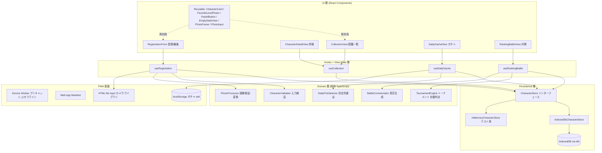
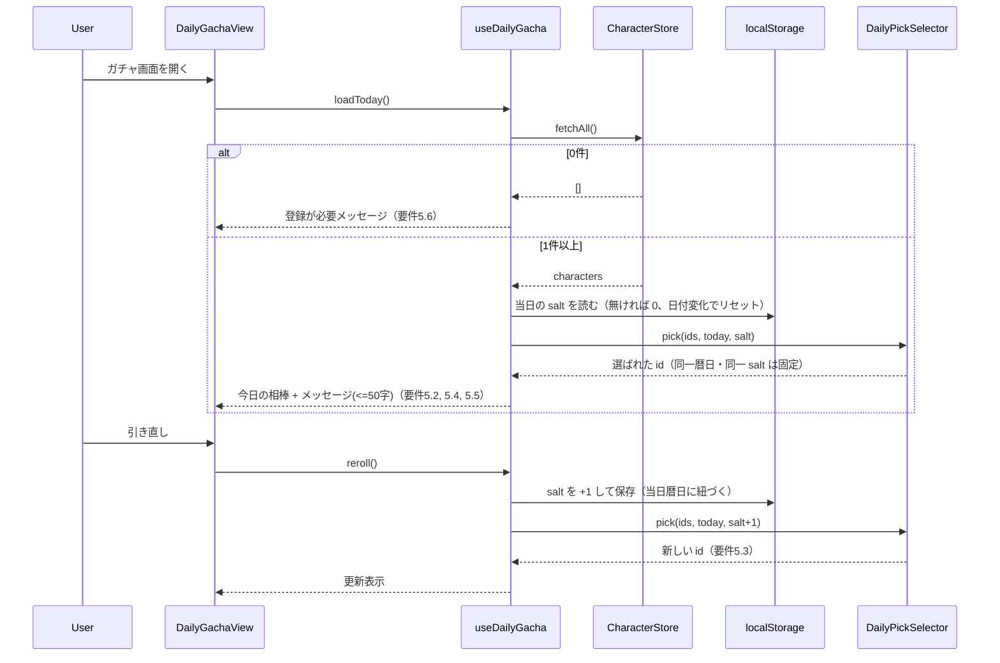
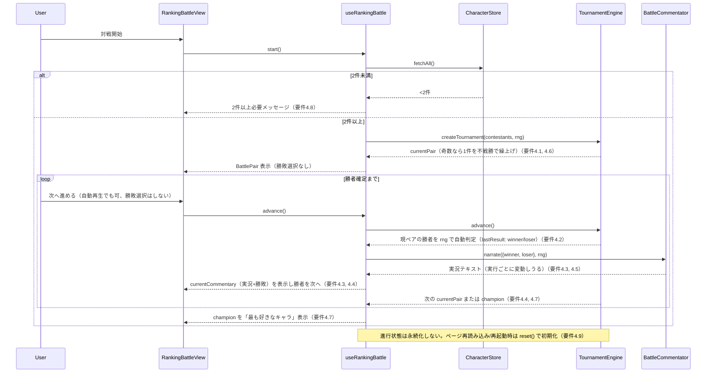

# Design Document

設計書

## Overview

概要

本設計書は、カップルが二人だけで楽しむ、iPhone のホーム画面に追加して使える **PWA（Progressive Web App）**「chara-collection（キャラ図鑑）」の技術設計を定義する。要件定義書（requirements.md、要件1〜要件8）に基づき、以下の3つの機能領域に「編集・削除」を加えて実装する。

1. **キャラ図鑑（Character Collection）**: 写真付きキャラクターの登録・一覧表示・詳細表示・編集・削除（要件1, 2, 6）
2. **今日の一枚ガチャ（Daily Gacha）**: 同一暦日内で固定される「今日の相棒」のランダム選出と引き直し（要件5）
3. **ランキング対戦（Ranking Battle）**: 全キャラクターによる勝ち抜きトーナメント（不戦勝対応）で一番のお気に入りを自動判定して決定（要件4）。各対戦の勝者は利用者が選ぶのではなく、**Chara_App がランダム要素を含めてちょうど1件を自動判定**する。対戦の様子・勝敗は、実行のたびにランダムに変わる **Battle_Commentary（それっぽい実況テキスト）** として表示し、同一の組み合わせでも**実行ごとに勝者・実況が変動**しうる。

### 技術方針

- **プラットフォーム**: Web（PWA）。iPhone Safari でホーム画面に追加し、スタンドアロン・ポートレートで起動する（要件7.1, 7.2）。オフラインファースト設計とする。
- **フレームワーク / 言語 / ビルド**: React + TypeScript + Vite（要件7.1）。
- **PWA 化**: `vite-plugin-pwa` により Web App Manifest と Service Worker を生成する。Service Worker がアプリシェルをプリキャッシュし、初回読み込み以降はオフラインで各機能を提供する（要件3.4, 3.5, 7.2, 7.3）。
- **永続化**: 端末内の **IndexedDB**。写真は **Blob** として保存する。IndexedDB の薄いラッパとして `idb` ライブラリを用いる（実装詳細）。サーバー同期・外部送信は一切行わない（要件3.1, 3.3, 3.8）。
- **写真取得**: HTML の `<input type="file" accept="image/*">` を用いる。モバイルでは `capture` 属性でカメラ起動を要求できる（要件1.2）。
- **UI**: パステルカラー基調・角丸多用のかわいくポップなデザインを **CSS（CSS カスタムプロパティ／トークン）** で実現する。重量級 UI フレームワークは用いない（要件7.4, 7.5）。
- **状態管理**: React の state + hooks を基本とし、小さなストア／コンテキスト層を許容する。ドメインロジックはフレームワーク非依存の**純粋 TypeScript モジュール**として切り出し、テスト容易性（property-based testing）を確保する。

### 開発環境に関する注記

本アプリは Web 技術（React / TypeScript / Vite / IndexedDB / PWA）のみで構成される。したがってビルド・実行・テストはすべて **Windows 環境で完結**する。macOS や Xcode は不要である。iPhone 実機での確認は、同一 LAN 上の Vite 開発サーバーへ Safari からアクセスするか、ビルド成果物を配信して行う（本番配信の詳細は本設計の範囲外）。

## Architecture

アーキテクチャ

### レイヤー構成

「UI（React コンポーネント）／ hooks + view-state（画面状態・ビューモデル相当）／ domain（純粋 TS）／ persistence（IndexedDB）／ PWA 基盤」に分離する。ドメインロジック（入力バリデーション、決定的な今日の一枚選出、トーナメント、写真処理）を UI・永続化から独立させることで、property-based testing を含む自動テストを可能にする。



### レイヤーごとの責務

- **UI 層（React コンポーネント）**: 画面描画とユーザー操作の受け取りのみ。状態は hooks から受け取り、ロジックを持たない。パステルテーマ・角丸・rem による文字サイズ追従・44×44 CSS px のタッチ領域・横スクロールなしのレスポンシブはここで担保する（要件7.4〜7.8）。
- **Hooks + View-State 層**: 画面状態（ローディング／エラー／入力値）の保持と、ユースケースの調停。React hooks（`useState` / `useEffect` / `useReducer`）で実装し、Domain 層と Persistence 層を呼び出す。MVVM の ViewModel に相当する責務を担う（本設計では「MV 的分離」と呼ぶ）。
- **Domain 層（純粋 TypeScript）**: 副作用を持たないフレームワーク非依存のモジュール。`CharacterValidator`（バリデーション）、`DailyPickSelector`（決定的選出）、`TournamentEngine`（トーナメントの勝者自動判定）、`BattleCommentator`（実況テキスト生成）、`PhotoProcessor`（画像形式・サイズ検証と正規化）。React にも IndexedDB にも依存しないため、単体テストと property-based testing の主対象となる。乱数を用いる `TournamentEngine`・`BattleCommentator` も、乱数生成器（rng）を外部注入することで純粋性・決定的テスト容易性を保つ。
- **Persistence 層**: `CharacterStore` インターフェースで永続化を抽象化し、既定実装は `IndexedDbCharacterStore`（`idb` 経由）。テスト時は `InMemoryCharacterStore` に差し替える。すべての操作は非同期（`Promise`）。
- **PWA 基盤**: `vite-plugin-pwa` が生成する Service Worker（アプリシェルのプリキャッシュ／オフライン提供）と Web App Manifest（ホーム画面追加）。写真取得の `<input type="file">`、およびガチャの salt を保持する `localStorage` もこの層に属する。

### MV 的分離とドメイン純粋化の理由

React コンポーネント（View）と hooks（View-State）を分離し、意思決定ロジックを純粋 TypeScript のドメインモジュールへ寄せる。これにより、ガチャの決定性・トーナメントの終了性・入力検証といった中核ロジックを、DOM やブラウザ API（IndexedDB, Service Worker, File API）から切り離してテストできる。純粋関数は fast-check による property-based testing に直接かけられ、100 回以上のランダム入力で普遍的性質を検証できる。

### 主要な設計判断とその根拠

| 判断 | 根拠 |
| --- | --- |
| React + TypeScript + Vite | 要件7.1 で指定。型安全・高速な開発サーバー・軽量ビルド。Windows で完結。 |
| PWA（vite-plugin-pwa） | 要件7.2, 7.3。Manifest + Service Worker をビルド時に生成し、ホーム画面追加とオフラインを実現。 |
| IndexedDB + `idb`（写真は Blob） | 要件3.1, 3.3。大容量バイナリを扱える端末内ストア。`idb` は薄い Promise ラッパで実装を簡潔化。 |
| `CharacterStore` インターフェース抽象 | 実装（IndexedDB）とテスト（インメモリ）を差し替え可能にするため。 |
| ドメインロジックの純粋 TS 化 | property-based testing（決定的選出・トーナメント・バリデーション）を成立させるため。 |
| Blob + Object URL 表示 | 写真表示は `URL.createObjectURL(blob)` で行い、不要時に `revokeObjectURL` で解放しメモリリークを防ぐ。 |

## Components and Interfaces

コンポーネントとインターフェース

### React コンポーネント

#### CollectionView（図鑑一覧）

登録済み Character を登録日時の新しい順（`createdAt` 降順）で一覧表示する（要件2.1）。各カードは写真・名前・（あれば）ニックネームを表示（要件2.3, 2.5, 2.6）。0 件時は空状態メッセージと新規登録導線を表示（要件2.7, 8.6）。写真読み込み失敗時は当該カードのみプレースホルダー表示にフォールバックし、他カードの表示は継続する（要件2.4）。ストア読み込み失敗時は再試行手段を提示（要件2.9）。

```tsx
function CollectionView(): JSX.Element {
  const { characters, loadState, reload } = useCollection();
  // grid/list, empty-state, retry-on-error を分岐表示
}
```

#### CharacterDetailView（詳細）

選択された Character の写真・名前・ニックネーム・メモ・お気に入り度を表示する（要件2.8）。編集・削除の導線を提供（要件6）。削除時は確認ダイアログを表示し、キャンセル時は元表示に戻す（要件6.5, 6.6, 6.7）。

#### RegistrationForm（登録 / 編集）

新規登録と編集の双方に用いる（要件1, 要件6.1）。入力欄: 名前（0〜50 文字・任意、要件1.4, 1.9）、ニックネーム（0〜50 文字、要件1.5）、メモ（0〜500 文字、要件1.6）、お気に入り度（1〜5、要件1.7）、写真取得（`PhotoInput`、要件1.2）。編集時は既存属性を初期表示（要件6.1）し、写真を差し替え可能（要件6.4）。写真未指定確定時・不正画像時・保存失敗時・ファイル選択キャンセル/ブロック時は入力内容を保持したままメッセージを表示（要件1.3, 1.10, 1.11, 1.12, 8.2〜8.5）。

#### DailyGachaView（今日の一枚ガチャ）

「今日の相棒」を写真・名前・短いメッセージ（最大50文字）とともに表示（要件5.4, 5.5）。引き直しボタンを提供（要件5.3）。0 件時は登録を促す（要件5.6）。

#### RankingBattleView（ランキング対戦）

現在の `BattlePair` 2 件を並べて表示する（要件4.1）。勝敗は利用者が選ぶのではなく、**Chara_App が自動的に勝者を判定**し、ランダムに変わる実況（`Battle_Commentary`）と勝敗結果を表示して自動進行する（要件4.2, 4.3）。利用者の操作は対戦を進めるための「開始」「次へ／自動再生」のみで、**勝敗の選択は行わない**。各対戦の実況表示後、勝者を次ラウンドへ進め、勝ち残りが 2 件以上ある間は次の `BattlePair` を提示する（要件4.4）。同一の組み合わせでも実行ごとに勝者・実況が変動しうる（要件4.5）。最終的に勝者 1 件を「最も好きなキャラ」として表示（要件4.7）。2 件未満なら開始せずメッセージ表示（要件4.8）。ページ再読み込み時は進行状態を破棄して初期化する（要件4.9）。

#### 再利用可能コンポーネント

- `CharacterCard`: 一覧カード。写真枠（角丸大）・名前・ニックネームを表示（要件2.3, 2.5, 2.6）。写真デコード失敗時はプレースホルダー（要件2.4）。
- `FavoriteLevelPicker`: 1〜5 のお気に入り度選択（ハート等のかわいい表現、44×44 CSS px 以上、要件1.7, 7.7）。
- `PastelButton`: 主要アクション用ボタン（パステルアクセント・角丸中・最小 44×44 CSS px、要件7.5, 7.7）。
- `EmptyStateView`: 空状態表示（要件2.7, 5.6, 8.6）。
- `PhotoFrame`: 角丸の写真表示枠。Blob から生成した Object URL を受け取り、`onError` でプレースホルダー表示（要件2.4）。
- `PhotoInput`: `<input type="file" accept="image/*" capture="environment">` をラップし、選択・キャンセル・ブロックを扱う（要件1.2, 1.11）。

### Hooks / View-State（ViewModel 相当）

```ts
type LoadState = 'idle' | 'loading' | 'loaded' | 'failed';

// 一覧（要件2）
function useCollection(): {
  characters: Character[];      // createdAt 降順
  loadState: LoadState;
  reload: () => Promise<void>;
  remove: (id: string) => Promise<void>;   // 要件6.7
};

// 登録/編集（要件1, 6）
function useRegistration(editing?: Character): {
  draft: CharacterDraft;                    // 入力保持用（失敗時も破棄しない）
  fieldErrors: FieldError[];
  setField: <K extends keyof CharacterDraft>(k: K, v: CharacterDraft[K]) => void;
  pickPhoto: (files: FileList | null) => Promise<void>;  // キャンセル/ブロック/不正を扱う
  save: () => Promise<SaveResult>;          // 'saved' | 'invalid' | 'storeError'
};

// 今日の一枚ガチャ（要件5）
function useDailyGacha(): {
  partner: Character | null;
  message: string;                          // <= 50 文字
  loadToday: () => Promise<void>;           // 同一暦日は固定
  reroll: () => Promise<void>;              // salt をインクリメント
};

// ランキング対戦（要件4）— 勝敗はアプリが自動判定し自動進行する（利用者の勝敗選択なし）
function useRankingBattle(): {
  currentPair: BattlePair | null;           // 現在提示中の対戦ペア（要件4.1）
  currentCommentary: BattleOutcome | null;  // 直近の対戦の実況 + 勝敗結果（要件4.2, 4.3）
  champion: Character | null;               // 勝ち残り1件確定時（要件4.7）
  canStart: boolean;                         // 2 件以上か（要件4.8）
  start: () => Promise<void>;                // 対戦を開始し最初のペアを提示（要件4.1）
  advance: () => void;                       // 次の対戦へ進める。呼ぶたびに現ペアの勝者を rng で自動判定し実況を生成（要件4.2〜4.4）
  reset: () => void;                         // 進行状態は非永続、再読み込みで初期化（要件4.9）
};
```

### Domain モジュール（純粋 TypeScript）

```ts
// 入力検証（要件1, 6.2, 8.1）
interface CharacterValidator {
  // name: 0..50, nickname: 0..50, memo: 0..500, favoriteLevel: 1..5(整数), photo: 必須
  validate(draft: CharacterDraft): FieldError[];
}

// 決定的な今日の一枚選出（要件5.1, 5.2, 5.3）
interface DailyPickSelector {
  // 同一暦日 + 同一コレクション + 同一 salt では常に同じ id を返す（決定的）
  pick(ids: string[], day: CalendarDay, salt: number): string | null;
  // reroll は salt を増やして再計算（呼び出し側が salt を管理）
}

// トーナメント（要件4）— 勝者はアプリが rng を用いて自動判定する（利用者選択なし）
interface TournamentEngine {
  readonly currentPair: BattlePair | null;   // 不戦勝は自動で次ラウンドへ繰上げ（要件4.1, 4.6）
  readonly champion: string | null;          // 勝ち残り 1 件確定時（要件4.7）
  readonly lastResult: { winner: string; loser: string } | null; // 直近の対戦結果（勝者id・敗者id）
  advance(): void;                            // 現ペアの勝者を rng で自動決定し次状態へ遷移（要件4.2, 4.4）
}
// ファクトリ: createTournament(contestants: string[], rng: () => number, shuffle?: (a: string[]) => string[])
//   rng: () => number は [0,1) の一様乱数。本番は Math.random、テストは固定/シード rng を注入する（決定的テスト容易性のため純粋性を保つ）。
//   advance() は currentPair の 2 件から rng を用いてちょうど 1 件を勝者に決定し、勝者を次ラウンドのキューへ進め、敗者を除外する。

// 実況生成（要件4.3, 4.5）— それっぽい実況テキストを rng でランダムに生成する純粋モジュール
interface BattleCommentator {
  // テンプレート集から rng で 1 つ選び、勝者/敗者名を差し込んだ実況文字列を返す。
  // 同一 pair でも rng により文面が変わりうる（実行ごとに変動）。rng 注入により決定性テスト可能。
  narrate(pair: { winner: string; loser: string }, rng: () => number): string;
}

// 画像検証・正規化（要件1.10, 8.2, 8.3）
interface PhotoProcessor {
  // 対応 MIME(JPEG/PNG/WebP)判定、サイズ上限チェック、必要なら Blob を返す
  validateAndProcess(file: File): Promise<Result<Blob, PhotoError>>;
}
```

### Persistence インターフェース

すべて非同期（`Promise`）で定義する。

```ts
interface CharacterStore {
  fetchAll(): Promise<Character[]>;     // createdAt 降順
  insert(character: Character): Promise<void>;
  update(character: Character): Promise<void>;
  delete(id: string): Promise<void>;
  count(): Promise<number>;             // 上限 1,000 件判定用
}

// 既定実装（idb 経由）
class IndexedDbCharacterStore implements CharacterStore {
  // insert 前に count() < 1000 を確認（要件2.2）
  // 保存失敗（QuotaExceededError/書込エラー）は StoreError に変換して throw（要件3.2, 8.4, 8.5）
}

// テスト用
class InMemoryCharacterStore implements CharacterStore { /* Map ベース */ }
```

## Data Models

データモデル

### Character 型（ドメイン）

```ts
interface Character {
  id: string;            // UUID（crypto.randomUUID()）
  name: string;          // 0〜50文字・任意（要件1.4, 1.9）
  nickname: string;      // 0〜50文字（要件1.5）。空文字は「未登録」扱い
  memo: string;          // 0〜500文字（要件1.6）
  favoriteLevel: number; // 1〜5 の整数（要件1.7, 8.1）
  photo: Blob;           // 写真バイナリ（要件1.8, 3.3）
  createdAt: number;     // 登録日時（epoch ミリ秒）。並び順・決定的選出のキー
}
```

### 属性の設計意図

| 属性 | 型 / 制約 | 根拠となる要件 |
| --- | --- | --- |
| `id` | `string`（UUID、一意） | 各 Character の同定。決定的選出・トーナメントのキー。 |
| `name` | `string`、0〜50、任意 | 要件1.4, 1.9（未入力可）。 |
| `nickname` | `string`、0〜50 | 要件1.5, 2.6。空文字は「未登録」として扱う。 |
| `memo` | `string`、0〜500 | 要件1.6, 2.8。 |
| `favoriteLevel` | `number`（整数 1〜5） | 要件1.7, 8.1。範囲外・非整数は保存拒否。 |
| `photo` | `Blob` | 要件1.8, 3.3。写真は必須。IndexedDB に Blob として格納。 |
| `createdAt` | `number`（epoch ms） | 要件2.1（新しい順）、要件5.2（暦日固定選出の安定キー）。 |

### IndexedDB オブジェクトストアスキーマ

- データベース名: `chara-collection`、バージョン `1`。
- オブジェクトストア: `characters`。
  - `keyPath: 'id'`（UUID を主キー）。
  - インデックス: `by-createdAt`（`keyPath: 'createdAt'`）。降順取得と並び替えに使用（要件2.1）。
- 写真は `Character.photo` フィールドに **Blob** として直接格納する。IndexedDB は Blob の保存に対応しており、別ファイル管理（孤児ファイル掃除）が不要なため、削除時の整合性が単純になる（要件1.8, 3.3, 6.7）。
- 表示時は `URL.createObjectURL(photo)` で Object URL を生成し、コンポーネントのアンマウント時に `URL.revokeObjectURL` で解放する（メモリリーク防止）。

### 容量上限（1,000 件）

`insert` 前に `store.count()` を評価し、1,000 件に達している場合は新規登録を拒否してユーザーに通知する（要件2.2）。`update` は件数を増やさないため上限の影響を受けない。

### 補助的な値型（永続化しない）

```ts
interface CharacterDraft {   // 入力保持用（要件1.3, 1.11, 1.12, 8.3〜8.5）
  name: string;
  nickname: string;
  memo: string;
  favoriteLevel: number;
  photo: Blob | null;        // 未取得は null
  editingId?: string;        // 未指定なら新規、値ありなら編集
}

interface CalendarDay {      // 端末ローカル暦日（要件5.2）
  year: number;
  month: number;             // 1〜12
  day: number;               // 1〜31
}

interface BattlePair { left: string; right: string; }   // 不戦勝は Pair を生成しない
// 対戦結果（勝敗はアプリが自動判定するため BattleSide は廃止。実況テキストを含む）
interface BattleOutcome {
  winner: string;      // 勝者 Character の id（要件4.2）
  loser: string;       // 敗者 Character の id
  commentary: string;  // 実行のたびにランダムに変わる実況テキスト（要件4.3, 4.5）
}

type Result<T, E> = { ok: true; value: T } | { ok: false; error: E };

type StoreError =
  | { kind: 'quotaExceeded' }
  | { kind: 'writeFailed' }
  | { kind: 'loadFailed' }
  | { kind: 'capacityReached' };

type PhotoError =
  | { kind: 'unsupportedFormat' }
  | { kind: 'tooLarge' }
  | { kind: 'acquisitionFailed' }   // キャンセル/ブロック等（要件1.11, 8.3）
  | { kind: 'cancelled' };

interface FieldError { field: 'name' | 'nickname' | 'memo' | 'favoriteLevel' | 'photo'; message: string; }
```

## Key Flows and Sequences

主要フローとシーケンス

### フロー1: 写真付き登録（ファイル選択のキャンセル/ブロック処理込み、要件1）


### フロー2: 今日の一枚ガチャ（決定的選出、要件5）



「今日の相棒」の固定は、当日暦日（`CalendarDay`）と現在の salt を `localStorage` に保存し、同一暦日内の再オープン時に同じ salt で再計算することで実現する（要件5.2）。日付が変わると salt を 0 にリセットする。

### フロー3: ランキング対戦のトーナメント進行（自動判定・実況・不戦勝・再読み込みリセット込み、要件4）



## Algorithms

アルゴリズム

### 決定的な「今日の一枚」選出

同一暦日内で結果を固定する（要件5.2）ため、選出をランダムではなく**決定的な計算**で行う。非決定的な `Math.random()` は今日の一枚選出には使用しない。乱数の状態を保存する代わりに、暦日と salt から安定なインデックスを導出する。

1. コレクションの id 配列を安定な順序（`id` の辞書順で昇順ソート）に整える。これにより同一集合なら常に同じ順序になる。
2. `CalendarDay`（year, month, day、端末ローカル）と `salt`、およびソート済み id 列を連結した文字列から、**安定な決定的ハッシュ**（例: FNV-1a などプラットフォーム非依存の小さなハッシュ関数）で 32bit の値 `h` を計算する。※ 実行毎にシードが変わる仕組みは使用しない。
3. `index = h mod count`、その位置の id を選出する。
4. 引き直し（要件5.3）は `salt` をインクリメントして再計算する。当日の salt は `localStorage` に保存し、同一暦日は再オープンでも同じ salt を用いて同じ結果を得る。日付が変わると salt を 0 にリセットする。

この設計により「同一暦日は固定」「再オープンでも同じ」「引き直しで変化」を、乱数状態の永続化なしに満たせる。純粋関数 `DailyPickSelector.pick(ids, day, salt)` は同一入力に対し常に同一出力を返すため、property-based testing で決定性・要素性を検証できる。

### トーナメントのブラケット生成と自動勝敗判定・不戦勝処理

全 Character を対象に勝ち抜き戦を行う（要件4）。勝敗は利用者が選ぶのではなく、注入された乱数生成器 `rng: () => number`（[0,1)）を用いて Chara_App が自動判定する。

1. 開始時、`contestants` を注入されたシャッフル関数（テスト時は恒等関数または固定順）で一度だけ並べ替え、初期ラウンドのキューとする。
2. 各ラウンドはキューから 2 件ずつ取り出して `BattlePair` を構成する。`advance()` を呼ぶと、現ペアの 2 件から **rng を用いてちょうど 1 件を勝者に自動決定**（例: `rng() < 0.5` で left、そうでなければ right）し、勝者を次ラウンドのキューへ追加、敗者を除外する（要件4.2, 4.4）。決定した勝者・敗者は `lastResult` として公開し、実況生成に用いる。
3. **不戦勝（要件4.6）**: ラウンドの残りが 1 件（奇数の余り）になった場合、その 1 件は対戦せず次ラウンドのキューへそのまま繰り上げる。1 ラウンドにつき不戦勝は最大 1 件。
4. あるラウンドを消化し切ったら次ラウンドへ移る。勝ち残りが 1 件になった時点でその 1 件を champion とする（要件4.7）。
5. 各対戦で敗者はキューから除外され、勝ち残り総数は単調減少する。したがって `N >= 2` の任意のコレクションと **任意の rng シード列**に対して、有限回で champion が 1 件に確定する（**終了保証**）。勝者の選択は rng に依存するが、勝ち残りが単調減少する事実は rng の値に依存しないため、終了性は rng によらず保証される。

**毎回結果が変わる根拠（要件4.5）**: `advance()` の勝敗は rng の値に応じて確率的に決まるため、同一の `BattlePair`・同一コレクションでも rng の系列が変われば勝者が変わりうる。本番は `Math.random` を rng として渡し、実行のたびに異なる勝者列が生じうる。

### 対戦実況（Battle_Commentary）の生成

各対戦の勝敗が決まると、`BattleCommentator.narrate({ winner, loser }, rng)` が実況テキストを生成する（要件4.3）。

1. 複数の実況テンプレート（例: 「{winner} が {loser} を圧倒！」「接戦の末、{winner} が {loser} を下した！」など）を持つ。
2. `rng` を用いてテンプレートを 1 つ選び、勝者・敗者の名前（またはニックネーム）を差し込んで文字列化する。
3. テンプレートが複数あるため、**同一の対戦結果でも rng の値が変われば異なる実況文面が生成されうる**（実行のたびにランダムに変わる、要件4.5）。
4. `narrate` は純粋関数であり、副作用を持たない。rng を外部注入するため、固定/シード rng を渡せば決定的に出力を検証できる（property-based testing 対応）。

## Persistence Design

永続化設計

### IndexedDB スキーマとバージョニング（idb 経由）

- `idb` の `openDB('chara-collection', 1, { upgrade })` でデータベースを開く。
- `upgrade` コールバックでオブジェクトストア `characters`（`keyPath: 'id'`）を作成し、`by-createdAt` インデックスを張る。
- `IndexedDbCharacterStore` が以下を提供する。
  - `fetchAll()`: `by-createdAt` インデックスで全件取得し、`createdAt` **降順**に整列して返す（要件2.1）。
  - `insert(character)`: 事前に `count()` を確認し、1,000 件到達時は `capacityReached` を throw（要件2.2）。
  - `update(character)`: 同一 `id` のレコードを `put` で上書き（写真差し替え含む）。件数は不変（要件6.3, 6.4）。
  - `delete(id)`: 当該 `id` を削除（要件6.7）。
  - `count()`: レコード数を返す。

### 写真ストレージ戦略（Blob と Object URL）

- 写真は `Character.photo` に **Blob** として保存する。取得直後に `PhotoProcessor` で対応 MIME（JPEG/PNG/WebP）と上限サイズを検証し、必要に応じて処理した Blob を保存する（要件1.8, 1.10, 8.2）。
- 表示時は `URL.createObjectURL(blob)` で Object URL を生成し、`PhotoFrame` / `CharacterCard` に渡す。コンポーネントのアンマウント時・画像差し替え時に `URL.revokeObjectURL` を必ず呼び、URL の蓄積によるメモリリークを防ぐ。
- 画像読み込み失敗（``）時はプレースホルダーへフォールバックし、他カードの表示は継続する（要件2.4）。

### エラー変換

IndexedDB の例外（`QuotaExceededError` など）や書き込み失敗は `StoreError`（`quotaExceeded`, `writeFailed`, `loadFailed`, `capacityReached`）に変換し、hooks 層が要件に対応したメッセージへマッピングする（要件3.2, 8.4, 8.5, 2.9, 3.7）。

### マイグレーション / バージョニング方針

初版は DB バージョン `1`・単一ストア。将来のスキーマ変更は `openDB` のバージョン番号を上げ、`upgrade(db, oldVersion, newVersion)` 内で `oldVersion` を判定してストア追加・インデックス変更・データ移行を段階的に行う。破壊的変更時も既存 Character データを消失させないマイグレーションを原則とする（要件3.7）。

## PWA Design

PWA 設計

### vite-plugin-pwa セットアップ

- `vite.config.ts` に `VitePWA({ registerType: 'autoUpdate', ... })` を追加し、ビルド時に Service Worker と Web App Manifest を生成する。
- 開発時の確認用に `devOptions.enabled` を有効化できる。

### Web App Manifest

- `name` / `short_name`: 「キャラ図鑑」相当。
- `icons`: 192×192・512×512（`maskable` を含む）。パステルパレットに合わせたアイコン。
- `theme_color` / `background_color`: パステルパレットのトークン値（例: 背景=クリーム、テーマ=パステルピンク）に一致させる。
- `display: 'standalone'`（アプリのように起動、要件7.2）。
- `orientation: 'portrait'`（縦向き、要件7.6 と整合）。
- `start_url: '.'` / `scope: '.'`。

### Service Worker のキャッシュ戦略

- **アプリシェルのプリキャッシュ**: `vite-plugin-pwa`（Workbox ベース）で JS/CSS/HTML/アイコン等のビルド成果物をプリキャッシュし、初回読み込み以降はオフラインでアプリシェルを提供する（要件3.4, 3.5, 7.3）。
- ユーザーデータ（Character・写真）は Service Worker のキャッシュではなく **IndexedDB** に保持するため、オフラインでも登録・一覧・対戦・ガチャが機能する。
- 更新は `autoUpdate`（新しい Service Worker を検出したら次回起動時に反映）。

### ホーム画面追加の挙動

iPhone Safari では「共有」→「ホーム画面に追加」でインストールする。追加後は Manifest の設定に従い、スタンドアロン・ポートレートで起動する（要件7.2）。

### iOS Safari の PWA 制約に関する注記

- iOS Safari の PWA は `beforeinstallprompt` に非対応で、インストールは手動操作（ホーム画面に追加）になる。UI 上で追加手順を案内することが望ましい。
- ストレージ退避（eviction）: iOS では長期間未使用の Web データが自動削除される可能性がある。本アプリはオフライン端末内保存が前提のため、この制約をユーザーに周知し、必要に応じて `navigator.storage.persist()` による永続化要求を試みる（保証はされない）。復元失敗時は非破壊で失敗を通知する（要件3.7）。

## Correctness Properties

正当性プロパティ

*プロパティとは、システムのすべての正当な実行にわたって成り立つべき特性や振る舞いのことであり、システムが何をすべきかについての形式的な言明である。プロパティは、人間が読める仕様と機械が検証可能な正当性保証との橋渡しとなる。*

以下は、Domain 層の純粋ロジック（バリデーション、決定的選出、トーナメント、永続化ラウンドトリップ、表示データ導出）に対する property-based testing の対象である。UI 見た目・PWA 基盤・パフォーマンスなどは普遍量化できないため対象外とし、Testing Strategy で例示テスト・スモークテスト等により扱う。これらのプロパティはプラットフォーム非依存のドメイン性質であり、要件番号を PWA 要件（要件1〜8）へ対応付けている。

### Property 1: フィールド文字数バリデーション

*任意の* `CharacterDraft` について、名前・ニックネームが 0〜50 文字かつメモが 0〜500 文字であれば当該フィールドは検証を通過し、いずれかがその上限を超える場合は当該フィールドの検証エラーを返す（名前は 0 文字も許可される）。

**Validates: Requirements 1.4, 1.5, 1.6, 1.9, 6.2**

### Property 2: お気に入り度の範囲バリデーション

*任意の* 値 `v` について、`favoriteLevel = v` が検証を通過するのは `v` が整数かつ `1 <= v <= 5` の場合に限り、範囲外・非整数の値は保存されず検証エラーとなる。

**Validates: Requirements 1.7, 8.1, 6.2**

### Property 3: 写真は必須

*任意の* 写真を持たない（`photo` が `null` の）`CharacterDraft` について、検証は「写真必須」エラーを返し、当該 draft の入力内容は変更されない。

**Validates: Requirements 1.3**

### Property 4: 非対応・過大画像の拒否

*任意の* 画像ファイルについて、それが対応 MIME（JPEG/PNG/WebP）でない、またはサイズ上限を超える場合、`PhotoProcessor.validateAndProcess` は対応する `PhotoError`（`unsupportedFormat` または `tooLarge`）の失敗を返す。

**Validates: Requirements 1.10, 8.2**

### Property 5: 保存・復元のラウンドトリップ

*任意の* 有効な `Character` について、ストアへ保存した後に取得（再読み込みを含む）すると、写真 Blob のバイト内容を含む全属性が等価な `Character` が得られる。

**Validates: Requirements 1.8, 3.3, 3.6**

### Property 6: 更新のラウンドトリップと件数不変

*任意の* 保存済み `Character` と *任意の* 有効な新属性について、更新すると取得結果は新属性を反映し、写真差し替えを含めて上書きされ、コレクションの件数は変化しない。

**Validates: Requirements 6.1, 6.3, 6.4**

### Property 7: 保存失敗時の原子性と入力保持

*任意の* 有効な `CharacterDraft` について、永続化が失敗する場合、当該 Character はストアに残らず（件数不変）、かつ draft の入力内容は保持される。

**Validates: Requirements 1.12, 3.2, 8.4, 8.5**

### Property 8: 削除は対象1件のみを除去

*任意の* Character 集合と *任意の* その要素について、削除するとコレクションから当該要素のみが取り除かれ（件数は 1 減少）、他の要素は不変のまま残る。

**Validates: Requirements 6.7**

### Property 9: 一覧は登録日時の降順

*任意の* Character 集合について、`fetchAll` の結果は入力集合の並べ替え（要素の過不足なし）であり、`createdAt` の降順に整列されている。

**Validates: Requirements 2.1**

### Property 10: 表示ビューの必須情報の網羅

*任意の* `Character` について、一覧カードおよび詳細ビューの表示モデルは名前・（存在すれば）ニックネーム・写真を含み、詳細ビューはさらにメモとお気に入り度を含む。

**Validates: Requirements 2.3, 2.5, 2.6, 2.8**

### Property 11: トーナメントは唯一の勝者で自動終了する

*任意の* 2 件以上の Character 集合と *任意の* rng シード列について、対戦を最後まで自動進行させると、進行中は常に現在の `BattlePair` が入力集合内の相異なる 2 件で構成され、最終的に入力集合の要素ちょうど 1 件が champion として確定して終了する（利用者の勝敗選択を要しない）。

**Validates: Requirements 4.1, 4.2, 4.7**

### Property 12: 自動判定は敗者を除外し勝者を進める

*任意の* rng シード列と各対戦について、rng により自動判定で選ばれた勝者は次の対戦へ進み、選ばれなかった敗者は以降のいずれの対戦にも現れず、勝ち残り総数は単調に減少する。

**Validates: Requirements 4.2, 4.4**

### Property 13: 奇数ラウンドの不戦勝

*任意の* 対象件数が奇数のラウンドについて、ちょうど 1 件が対戦せずに次ラウンドへ進み（不戦勝）、当該ラウンドのすべての Character が過不足なく次ラウンドへ引き継がれる。

**Validates: Requirements 4.6**

### Property 14: 対戦実況は妥当で実行ごとに変動しうる

*任意の* `BattleOutcome`（勝者・敗者）と *任意の* rng について、`BattleCommentator.narrate` は空でない実況文字列を返し、その中に勝者を表す情報（勝者名／ニックネーム）が差し込まれている。加えて、実況テンプレートは複数存在し、rng の値を変えると同一の対戦結果に対して**複数の異なる実況文面が生成されうる**（すなわち出力は rng に依存して変動しうる）。

**Validates: Requirements 4.3, 4.5**

### Property 15: 今日の一枚は暦日内で決定的かつコレクションの要素

*任意の* 空でない Character コレクションと *任意の* 固定した `CalendarDay` および salt について、`DailyPickSelector.pick` は常にコレクションに属する同一の id を返す（再計算・再呼び出しでも不変）。引き直し（salt 変更）後の結果も常にコレクションの要素である。

**Validates: Requirements 5.1, 5.2, 5.3**

### Property 16: 今日のメッセージは50文字以下

*任意の* 選出された「今日の相棒」について、併記される短いメッセージの文字数は 50 以下である。

**Validates: Requirements 5.5**

## Error Handling

エラーハンドリング

エラーは発生層で `StoreError` / `PhotoError` / 検証エラー（`FieldError`）に正規化し、hooks 層が要件に対応するユーザー向けメッセージと導線へマッピングする。共通方針として、エラー時も**入力内容と保存済みデータを破棄しない**。

| エラー / 空状態の状況 | 検出層 | 挙動 | 対応要件 |
| --- | --- | --- | --- |
| 写真未指定で確定 | Validator（domain） | 登録保留・入力保持・「写真必須」表示 | 1.3 |
| 名前/ニックネーム/メモの文字数超過 | Validator（domain） | 保存拒否・該当欄にエラー表示・入力保持 | 1.4, 1.5, 1.6, 6.2 |
| お気に入り度が 1〜5 の整数以外 | Validator（domain） | 保存拒否・「1〜5の整数で選択」表示 | 1.7, 8.1 |
| 非対応形式/過大サイズ画像 | PhotoProcessor（domain） | 取り込み拒否・形式/サイズの目安提示・やり直し促し | 1.10, 8.2 |
| ファイル選択キャンセル / ブラウザがアクセスをブロック | PhotoInput / useRegistration | 写真未取得を通知・入力保持・再取得を促す | 1.11, 8.3 |
| 保存が容量超過で失敗（QuotaExceededError） | Store（persistence） | 中止・入力保持・容量不足と不要データ削除の促し | 1.12, 3.2, 8.4 |
| 保存がその他理由で失敗 | Store（persistence） | 中止・入力保持・再試行の促し | 3.2, 8.5 |
| 一覧の写真1件の読込失敗（img onError） | UI（CharacterCard/PhotoFrame） | 当該のみプレースホルダー・他は継続表示 | 2.4 |
| ストア読込失敗 | Store / hooks | 失敗表示 + 再試行手段・保存済みデータ保持 | 2.9 |
| 再起動時の復元失敗 | Store / hooks | 失敗表示・保存済みデータを消失させない | 3.7 |
| 上限1,000件到達 | Store（persistence） | 新規登録を拒否し通知 | 2.2 |
| コレクション0件（一覧/ガチャ） | hooks | 空状態メッセージ・登録手順/登録要求 | 2.7, 5.6, 8.6 |
| 対戦が2件未満 | hooks | 開始せず「2件以上必要」表示 | 4.8 |
| 対戦中の再読み込み/再起動 | hooks | 進行状態を破棄し初期化（非永続） | 4.9 |

## Testing Strategy

テスト戦略

### 方針: ユニットテスト + プロパティテストの併用

- **ユニットテスト（Vitest + React Testing Library）**: 具体例・エッジケース・エラー分岐・UI 分岐（空状態、ファイル選択キャンセル/ブロック、削除確認、写真読込失敗のプレースホルダー、対戦2件未満、対戦中リセット等）を検証する。
- **プロパティテスト（Vitest + fast-check）**: Domain 層の普遍的プロパティ（Correctness Properties の Property 1〜16）を、広い入力空間にわたって検証する。

### 実行環境の注記

本アプリは Web 技術のみで構成されるため、ビルド（`vite build`）・テスト（`vitest`）・実行はすべて **Windows で完結**する。macOS や Xcode は不要である。Vitest はウォッチではなく単発実行（`vitest run`）を用いる。

### プロパティテストのライブラリと構成

- property-based testing ライブラリ **fast-check** を採用する（ゼロから実装しない）。Vitest の `test`/`it` と組み合わせて利用する。
- 各プロパティテストは **最低 100 回**の反復（`fc.assert(fc.property(...), { numRuns: 100 })`）で実行する。
- 各プロパティテストには、対応する設計プロパティを参照するコメントを付与する。タグ形式:
  `// Feature: chara-collection, Property {number}: {property_text}`
- 各 Correctness Property は **単一の** プロパティテストで実装する。
- ジェネレータは以下を網羅する: 文字数の境界（0/50/51、0/500/501）、`favoriteLevel` の範囲内外および非整数、非対応 MIME・過大サイズの Blob/File、`CalendarDay` と salt の多様な組、2 件以上（偶数/奇数）のコレクションと**任意の rng シード列（トーナメント自動判定）**、勝者/敗者名の組と rng（実況生成）。
- 乱数を用いる `TournamentEngine` と `BattleCommentator` は rng（`() => number`）を外部注入するため、テストでは固定/シード rng（例: 値の系列を返すスタブ）を渡して決定的に検証する。本番は `Math.random` を注入する。

### プロパティ ↔ テスト対応

| Property | 主な検証内容 | テスト対象 |
| --- | --- | --- |
| 1 | 名前/ニックネーム/メモの文字数境界 | `CharacterValidator` |
| 2 | favoriteLevel 1〜5（整数） | `CharacterValidator` |
| 3 | 写真必須 | `CharacterValidator` |
| 4 | 非対応/過大画像の拒否 | `PhotoProcessor` |
| 5 | 保存→取得ラウンドトリップ（Blob 含む） | `InMemoryCharacterStore` |
| 6 | 更新ラウンドトリップ・件数不変 | `InMemoryCharacterStore` |
| 7 | 保存失敗時の原子性・入力保持 | 失敗スタブ Store + `useRegistration`/save ロジック |
| 8 | 削除は対象1件のみ | `InMemoryCharacterStore` |
| 9 | createdAt 降順整列 | `CharacterStore.fetchAll` |
| 10 | 表示ビューの必須情報 | カード/詳細の表示モデル導出関数 |
| 11 | 唯一の勝者で自動終了（rng シード列） | `TournamentEngine`（rng 注入） |
| 12 | 自動判定の敗者除外・単調減少（rng シード列） | `TournamentEngine`（rng 注入） |
| 13 | 奇数ラウンドの不戦勝 | `TournamentEngine`（rng 注入） |
| 14 | 実況の妥当性・実行ごとの変動（複数テンプレート＋rng） | `BattleCommentator`（rng 注入） |
| 15 | 暦日内決定的・要素性 | `DailyPickSelector` |
| 16 | メッセージ50文字以下 | メッセージ生成関数 |

### ユニットテスト（例示・エッジ・エラー分岐）

- ファイル選択キャンセル/ブロック時に入力保持・再取得を促す（要件1.11, 8.3）
- 空コレクション時の空状態表示（要件2.7, 5.6, 8.6）
- 対戦2件未満のガード（要件4.8）／対戦中の再読み込みでのリセット（要件4.9）
- 実況（`Battle_Commentary`）は複数テンプレートから rng でランダム生成し、rng を固定/シードして決定的にテストする（勝者/敗者名の差し込み・非空文字列を検証、要件4.3, 4.5）
- 削除の確認要求・キャンセル・確定（要件6.5, 6.6）
- 上限1,000件のエッジケース（要件2.2）
- 一覧写真1件の読込失敗時のプレースホルダー（要件2.4）
- ストア読込/復元失敗時の非破壊挙動（要件2.9, 3.7）
- `PhotoInput` が `accept="image/*"` / `capture` 属性を持つこと（要件1.2）

### PWA / UI / 非機能テストの考慮（スモーク・計測）

- **PWA スモーク**: Lighthouse の PWA チェックで Web App Manifest の妥当性（`display: standalone`、アイコン、theme/background color）とオフライン起動（Service Worker によるアプリシェル提供）を確認する（要件7.2, 7.3, 3.4, 3.5）。
- **UI 見た目**: パステル配色・角丸・44×44 CSS px タッチ領域・rem による文字サイズ追従・横スクロールなしのポートレートレイアウト（要件7.4〜7.8）は、スナップショットテストと目視・複数フォントサイズでの確認で扱う。
- **外部送信なし**: ネットワーク層が存在しない構成であることをコード検査/スモークで確認する（要件3.8）。
- **タイミング計測**: IndexedDB 永続化3秒以内（要件3.1）、ガチャ表示2秒以内（要件5.4）を計測（統合テスト）で確認する。

## Design Theme and Design System

デザインテーマとデザインシステム

要件7（かわいくポップな PWA UI）を満たすため、CSS カスタムプロパティによる再利用可能なデザイントークンとコンポーネントを定義する。重量級 UI フレームワークは使用しない。

### カラートークン（パステル基調・要件7.4）

`:root` に CSS カスタムプロパティとして定義する（Manifest の theme/background color とも一致させる）。

```css
:root {
  --color-primary: #ffb6c8;      /* パステルピンク（主要アクセント） */
  --color-secondary: #b8ecd0;    /* パステルミント（補助アクセント） */
  --color-accent: #d9c8f5;       /* パステルラベンダー（強調・お気に入り度） */
  --color-background: #fff8f0;   /* クリーム（画面背景 / manifest background_color） */
  --color-surface: #ffffff;      /* カード面 */
  --color-text-primary: #4a4a4a; /* 本文 */
  --color-text-secondary: #8a8a8a;
}
```

### コーナー半径トークン（角丸・要件7.5）

```css
:root {
  --radius-small: 0.5rem;   /* 小要素 */
  --radius-medium: 1rem;    /* ボタン・入力欄 */
  --radius-large: 1.5rem;   /* カード・写真枠 */
}
```

### タイポグラフィ（文字サイズ追従・要件7.8）

- フォントサイズは固定 px を避け、**rem** で定義してブラウザ/OS の文字サイズ設定に追従させる。
- 見出しは丸みのある書体でポップな印象を与える。本文は可読性を優先したコントラストを確保する。

### レイアウトとタッチ領域（要件7.6, 7.7）

- モバイルポートレートを基準に、`max-width` とパーセンテージ/フレックスで**横スクロールを発生させない**レスポンシブレイアウトとする（要件7.6）。
- すべてのインタラクティブ要素（ボタン、お気に入り度選択、カード等）は **最小 44×44 CSS px** のタッチ領域を持たせる（`min-width: 44px; min-height: 44px;`）（要件7.7）。

### 再利用可能コンポーネントのスタイル

- `CharacterCard`: 写真枠（`--radius-large`）・名前・ニックネーム。写真デコード失敗時プレースホルダー（要件2.3〜2.6, 2.4）。
- `FavoriteLevelPicker`: 1〜5 のかわいい選択（ハート等、44px 以上、要件1.7, 7.7）。
- `PastelButton`: `--color-primary` / `--radius-medium` / 最小 44×44 px（要件7.5, 7.7）。
- `EmptyStateView`: 空状態（要件2.7, 5.6, 8.6）。
- `PhotoFrame`: 角丸写真枠（`--radius-large`）、Object URL 表示・`onError` フォールバック。
- `PhotoInput`: `<input type="file" accept="image/*" capture="environment">`（要件1.2）。

## Requirements Traceability

要件トレーサビリティ

| 要件 | 対応する設計要素 |
| --- | --- |
| 要件1（写真付き登録） | `RegistrationForm` / `useRegistration` / `CharacterValidator` / `PhotoProcessor` / `PhotoInput` / フロー1 / Property 1〜5, 7 |
| 要件2（一覧表示・図鑑） | `CollectionView` / `useCollection` / `CharacterCard` / `EmptyStateView` / `fetchAll`（降順）/ 上限1,000件 / Property 8〜10 |
| 要件3（オフライン保存） | `CharacterStore` / `IndexedDbCharacterStore`（idb）/ Blob 写真 / Service Worker / Persistence Design / PWA Design / Property 5, 7 |
| 要件4（ランキング対戦） | `RankingBattleView` / `useRankingBattle`（`advance` 自動進行）/ `TournamentEngine`（rng 自動判定）/ `BattleCommentator`（実況生成）/ フロー3 / 自動判定トーナメントアルゴリズム / Property 11〜14 |
| 要件5（今日の一枚ガチャ） | `DailyGachaView` / `useDailyGacha` / `DailyPickSelector` / localStorage salt / フロー2 / 決定的選出アルゴリズム / Property 15, 16 |
| 要件6（編集・削除） | `RegistrationForm`（編集）/ `CharacterDetailView`（削除確認）/ `CharacterStore.update` / `delete` / Property 6, 8 |
| 要件7（PWA・かわいいデザイン） | PWA Design（Manifest/Service Worker）/ Design Theme and Design System（CSS トークン/角丸/rem/44px/レスポンシブ） |
| 要件8（空状態・入力エラー） | `CharacterValidator` / `EmptyStateView` / Error Handling マッピング表 / Property 1〜4, 7 |
